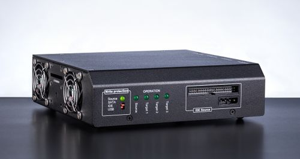

---
tags:
  -  Hardware
  -  Disk Imaging
---
[Atola Insight Forensic](http://atola.com/products/insight/) is a fast
forensic imaging system produced by [Atola
Technology](http://atola.com/) capable of diagnosing and imaging damaged
and unstable drives. It offers sophisticated data retrieval functions
along with utilities for manually accessing hard drives at the lowest
level, wrapped in a simple and efficient user interface. The tool is
developed by a team of data recovery engineers in collaboration with law
enforcement agencies and forensic experts.

### The system has several key features for data capture in forensic and e-discovery cases:

- Fastest in industry imaging speed up to 550 MB/s
- High-performance multi-pass imaging for damaged drives
- In-depth Automatic HDD diagnostics
- Extraction of unknown ATA Passwords
- Case management system prepares acquisition reports automatically
- Hash calculation: MD5, SHA1, SHA224, SHA256, SHA384, SHA512
- Unclip DCO (device configuration overlay) and HPA (host protected
  area)
- Forensic data erasure methods including DoD 5220.22-M, Security Erase,
  NIST 800-88, Pattern Erase
- File recovery for NTFS (all versions), Ext 2/3/4, HFS, HFS+, HFSX,
  ExFAT, FAT16, FAT32, APFS
- Support for SATA, IDE, SAS, USB media
- Support for Apple PCIe (2013 - recent models), NVMe and M.2 PCIe SSDs
  via Atola extension modules
- Built-in write blocker
- Optional 10Gb Ethernet via extension modules
- Search of forensic artifacts: GPS coordinates, phone numbers, emails,
  URLs, IP and MAC addresses, credit card numbers, custom keywords and
  regular expressions

### Major Imaging Parameters:

- Multi-pass imaging system with adjustable settings for damaged media
- Linear and segmented hash calculation (pre-hash, during imaging,
  post-hash)
- Selective head imaging
- Handling of freezing drives (automatic reset and power cycle commands)
- HEX pattern to fill skipped sectors with (00 by default)
- Automatic split file creation mode: .001, .002, .003, etc.
- Image file on a source device
- Create encrypted password-protected VeraCrypt volume on a target drive
  to store images
- Creation of E01 segmented files (E01, E02, etc) supported
- Compare media after imaging and hash verification

### Atola Insight Forensic system includes:

- Atola Insight Forensic software (runs on any Windows PC or laptop)
- DiskSense hardware unit
- Hardware extensions (optional)
- Battery (optional)