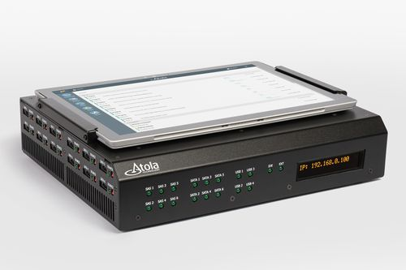

---
tags:
  -  Hardware
  -  Disk Imaging
---
[Atola TaskForce](https://atola.com/products/taskforce/) is a forensics
imager by [Atola Technology](https://atola.com/), designed for working
with both good and damaged media with a focus on high-performance (up to
18 parallel imaging sessions at 15 TB/hour).

## General Information

- Supports SAS, SATA, USB and IDE drives via 18 ports
- Multitasking at 15 TB/hour (imaging, hashing, wiping in parallel on
  all ports)
- Diagnostics for drive condition assessment, imaging time estimate,
  detection of file systems and restricted areas (encrypted,
  password-protected, HPA/DCO)
- Evidence drives can be imaged to up to 5 targets each. The targets may
  include other drives, image files (E01, RAW, img or dd) on a target
  drive or on a server, or a combination of all of the above
- [Multi-user access](https://atola.com/products/taskforce/multi-user.html) allows a
  group of operators to work simultaneously on different tasks, tracking
  the progress remotely and using multitasking capabilities to the full.
- Standalone mode for in-the-field imaging

## Imaging

- 12+ simultaneous imaging sessions
- RAID support
- Express mode
- Web API for imager integration into workflow automation tools
- Imaging to E01 and RAW files
- Imaging to encrypted target drives (VeraCrypt)
- Selective partition acquisition

## Hardware unit

- Ports: 6x SATA, 6x SAS/SATA, 4x USB, IDE + extensions for NVMe, PCIe,
  Apple SSD, MacBooks, etc.
- Source switches on all ports for hardware write protection
- Server-grade motherboard, 8-thread Xeon CPU 3.7 GHz and ECC RAM
- 2x 10Gb Ethernet ports
- Touch screen

## Other features

- Standalone mode
- Multi-user access when connected to a network (web-based interface)
- Unknown ATA password recovery
- HPA & DCO recovery
- Hash calculation (MD5, SHA1, SHA256, SHA512)
- Wiping with various methods: custom pattern, NIST 800-88, DoD
  5220.22-M, random, LBA number
- Case management and automatic report generation

## Damaged drive support

Imaging of drives with surface scratches, logical errors, broken heads,
worn-out magnetic layer and firmware issues:

- In-depth drive diagnostics
- Selective head imaging
- Automated multi-pass system for gentle yet thorough imaging of damaged
  media
- Imaging of freezing drives
- Segmented hashing to verify images from media with bad sectors
- Automatic overcurrent and short-circuit protection