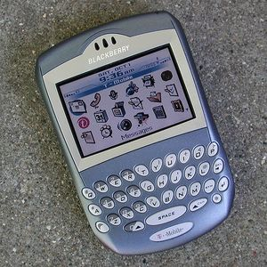

---
tags:
  - Organization
---
)

The RIM **BlackBerry** is a personal wireless handheld
device that supports e-mail, [mobile phone](mobile_phone.md)
capabilities, text messaging, web browsing, and other wireless
information services. It is most commonly utilized for business
purposes.

## History

The BlackBerry was first introduced in 1999 by a company called
[Research In Motion (RIM)](research_in_motion_limited.md).

## Operating System

The [BlackBerry OS](blackberry_os.md) provides easy access to
applications such as e-mail, to do list, memos, address book, and many
other features. With the newer operating systems 4.1 and later,
composing messages are much more convenient by providing auto text.

## Models

- 6200 Series
- 6500 Series
- 6700 Series
- 7100 Series
- 7130 Series
- 7200 Series
- 7700 Series
- 7500 Series
- 7700 Series
- 8100 Series
- 8300 Series
- 8700 Series
- 8800 Series
- BlackBerry Storm
- BlackBerry Bold
- BlackBerry Pearl
- BlackBerry Curve

## Forensics

[Forensics on the RIM platform](blackberry_forensics.md) is
complicated by the fact that this is a "push" device --- the RIM server
will push device to the PDA whenever the PDA's radio
is on and there is data available.

RIM devices also feature a remote self-destruct feature. This feature
cannot be activated if the radio is turned off, of course.

Both of these features mean that you need to be sure that the radio is
off when doing a forensic investigation.

Depending on the setting, entering a wrong password a certain number of
times will wipe the device.

## References

- [BlackBerry.com](https://www.blackberry.com/us/en), the BlackBerry main site.
- [BlackBerry Frequently Asked Questions](http://www.blackberryfaq.com),
  Largest collaboration of Answers to Questions for BlackBerry
- [Forensic Examination of a RIM (BlackBerry) Wireless Device](https://www.yumpu.com/en/document/view/8792468/forensic-examination-of-a-rim-blackberry-wireless-device)
