---
tags:
  - Mobile 
---
## Tear Down

1.  Remove the back panel which holds the battery in place.
2.  Remove the SIM and SD Memory Card.
3.  Flip phone and remove the Vendor plate

 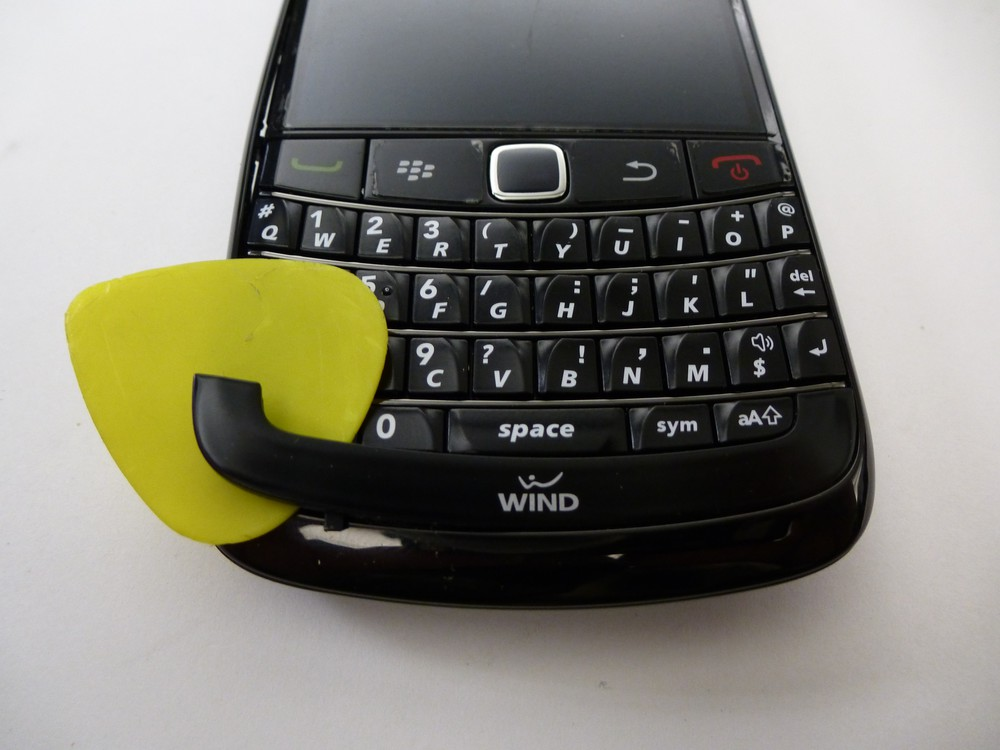
 <figcaption
 aria-hidden="true">1-BB9780-VendorPlateRemoval.jpg</figcaption>

4.  Using a torx-5 screw driver remove the 2 visible screws under the
    vendor.

 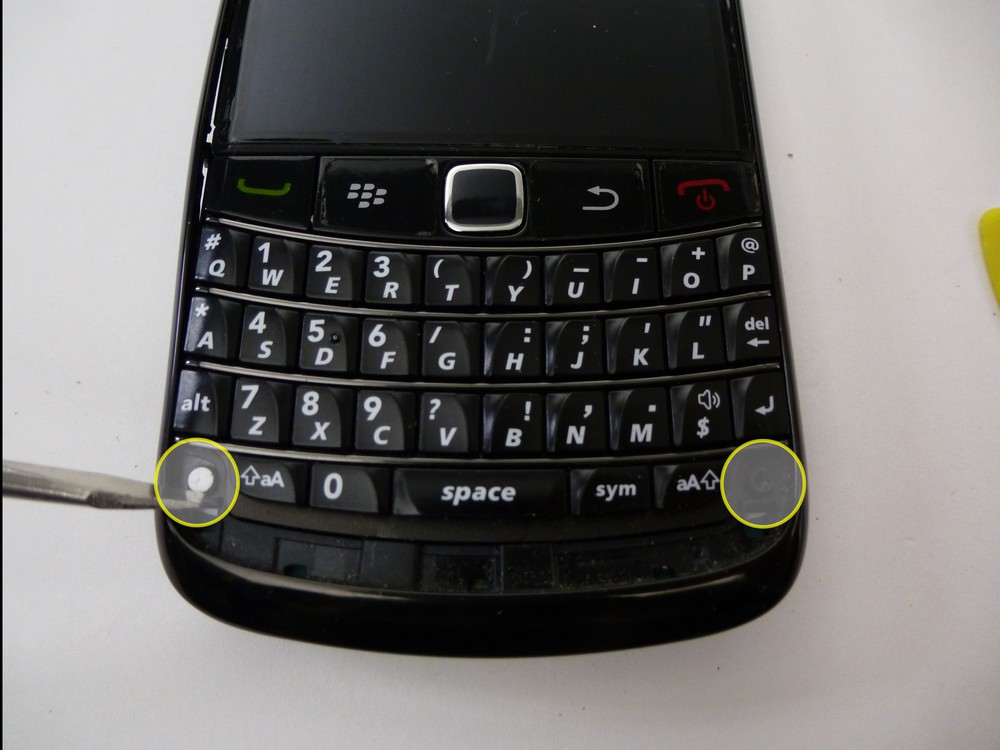
 <figcaption aria-hidden="true">2-BB9780-ScrewRemoval.jpg</figcaption>

5.  Use a guitar pick or pry tool to remove the outer bezel.

 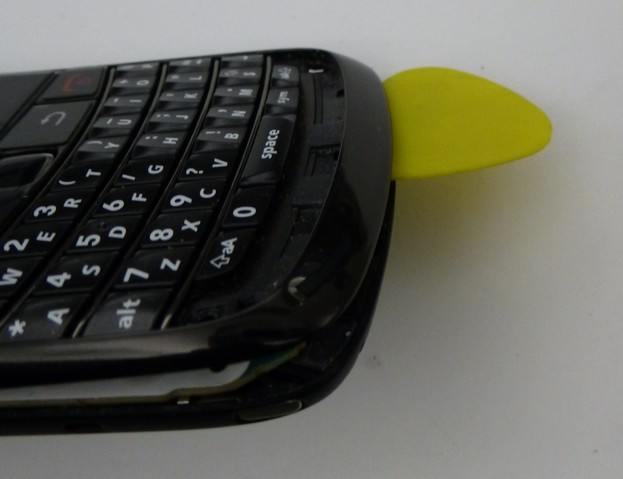
 <figcaption aria-hidden="true">3-BB9780-BezelRemoval.jpg</figcaption>

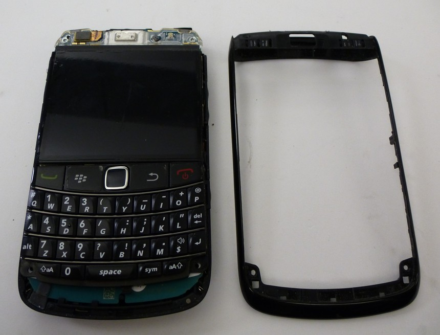
<figcaption aria-hidden="true">4-BB9780-BezelRemoved.jpg</figcaption>

6.  Gently remove the keyboard to 4 additional torx-5 screws to be
    removed.

 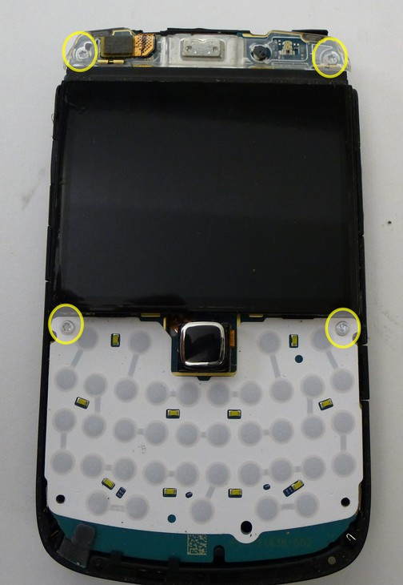
 <figcaption aria-hidden="true">5-BB9780-ScrewRemoval.jpg</figcaption>

7.  Release the flex cable in the top left corner and remove the
    LCD/Motherboard from the housing.

 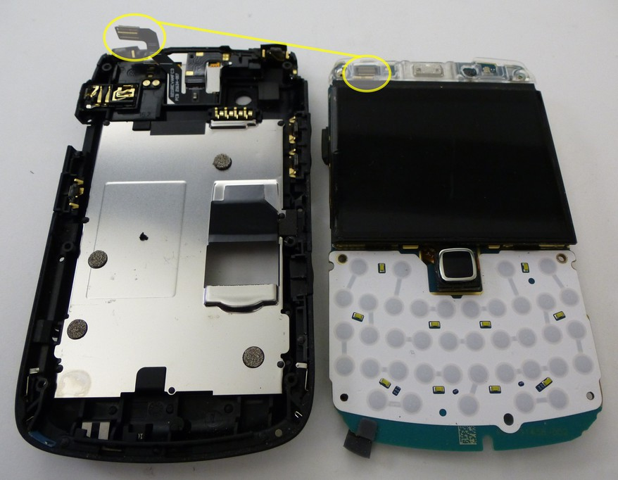
 <figcaption aria-hidden="true">6-BB9780-LCDRemoval.jpg</figcaption>

8.  Release the LCD and pointer flex cables and remove the LCD from the
    Motherboard.

 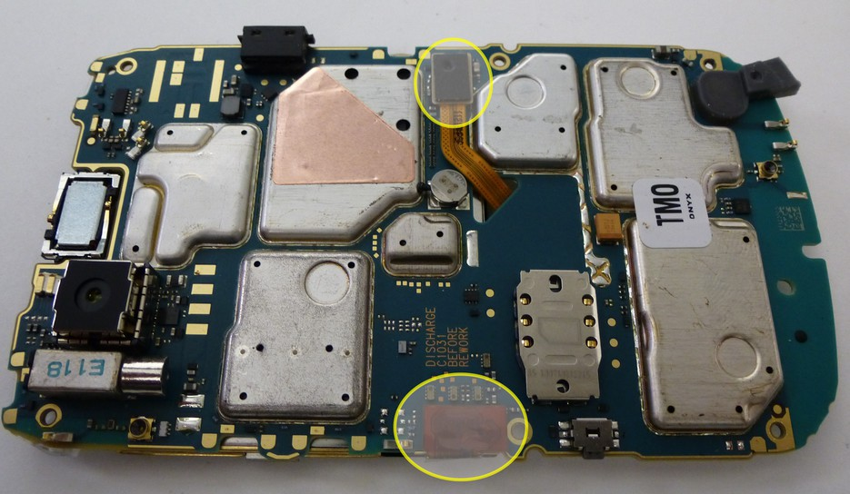
 <figcaption aria-hidden="true">7-BB9780-LCDRemoval.jpg</figcaption>

9.  The tear down is now complete

 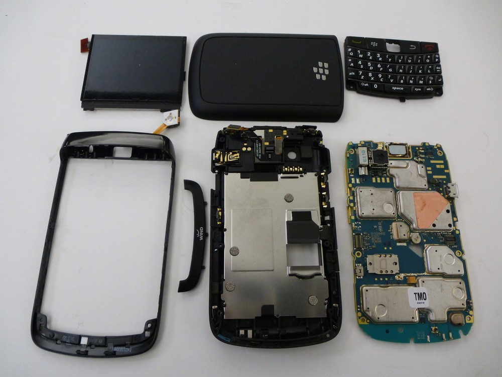
 <figcaption
 aria-hidden="true">8-BB9780-TearDownComplete.jpg</figcaption>

## NAND Removal

1.  The NAND is located beneath the heat shield to the left of the USB
    port.

 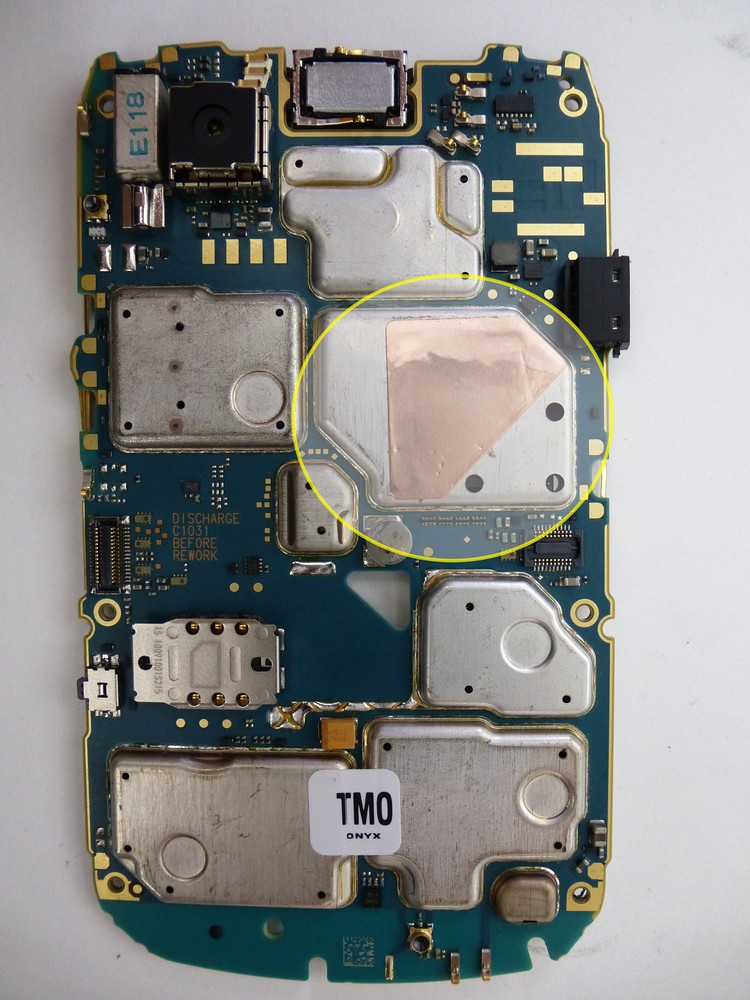
 <figcaption aria-hidden="true">9-BB9780-NAND-Location.jpg</figcaption>

2.  Place the main board in a stand or holder and position it under a
    heat gun or device the blows super hot air. We use a Wagner "model
    XYZ" positioned approximately 2 1/2" - 3" inches away from the main
    board.

 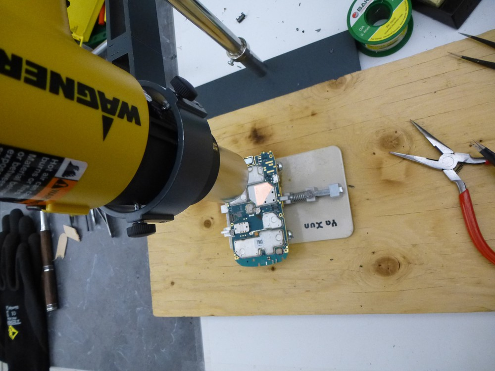
 <figcaption aria-hidden="true">10-BB9780-Positioning.jpg</figcaption>

3.  Monitoring the temperature the heat shield will come off easily
    between 190-200 Centigrade.

 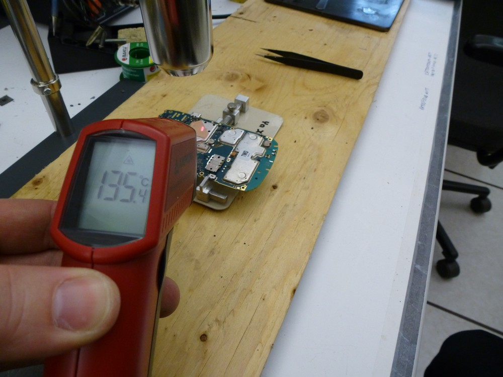
 <figcaption aria-hidden="true">11-BB9780-Temperature.jpg</figcaption>

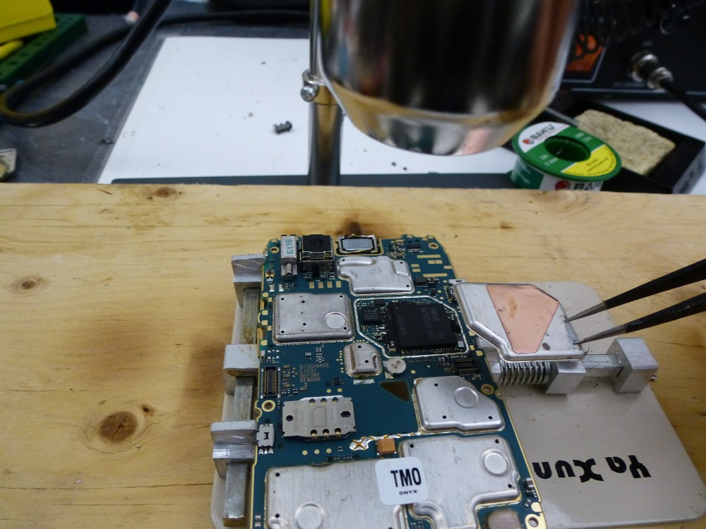
<figcaption
aria-hidden="true">12-BB9780-HeatSheildRemoved.jpg</figcaption>

4.  Continue working under the high heat. In the 9780's I've worked on
    there is typically a black epoxy that has been applied to the NAND.
    Using a razor under the high heat this epoxy can be easily cut into.
    Once the epoxy has been cut and with the temperature around 215
    Centigrade the NAND will be easily removed from the main board.

 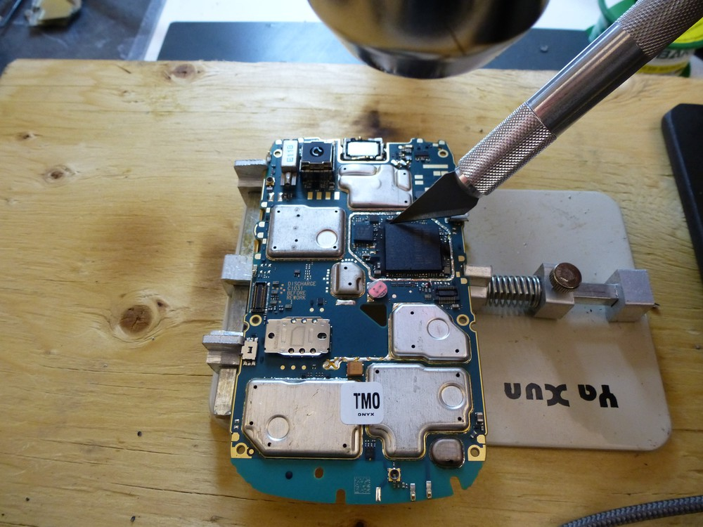
 <figcaption aria-hidden="true">13-BB9780-NANDRemoval.jpg</figcaption>

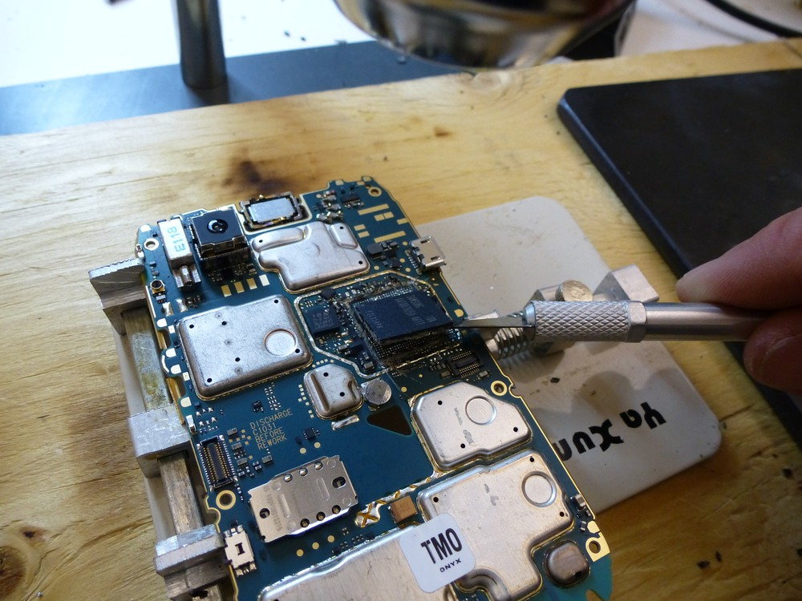
<figcaption aria-hidden="true">14-BB9780-NANDRemoved.jpg</figcaption>

The BlackBerry Bold 9780 uses a stacked die 152 pin BGA, this includes a
NAND stacked on a controller which is soldered to the main board. We are
interested in the NAND and therefore must separate it from the
controller. This is accomplished with the use of high heat (heat gun), a
20 x 20 x 0.5cm steel plate and a 10cm razor blade.

5.  Position the steel plate under the heat gun. The plate will heat up
    and hold the heat be mindful not to burn yourself.
6.  Transfer the NAND+Controller to the plate and allow the chip to take
    in some heat \~1min
7.  Using long tweezers to hold the chip and the 10cm razor begin
    slicing away the epoxy that is surrounding the chip with a sharp
    razor the epoxy will slice easily allowing you to see a tiny gap
    between the NAND and the controller.

 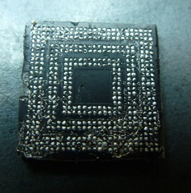
 <figcaption aria-hidden="true">13-3-EpoxyCleanup.jpg</figcaption>

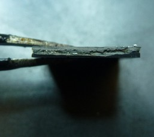
<figcaption aria-hidden="true">13-4-EpoxyCleanup.jpg</figcaption>

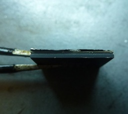
<figcaption aria-hidden="true">13-5-EpoxyCleanup.jpg</figcaption>
 
 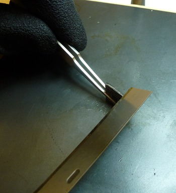
 <figcaption aria-hidden="true">13-1-EpoxyCleanup.jpg</figcaption>
                                                                     
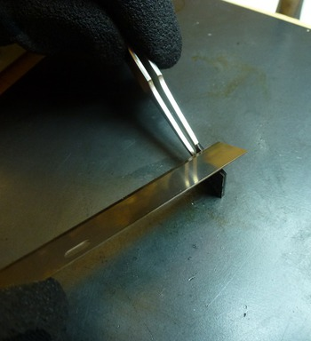
<figcaption aria-hidden="true">13-2-EpoxyCleanup.jpg</figcaption>

8.  The razor can then be used to separate the two.

 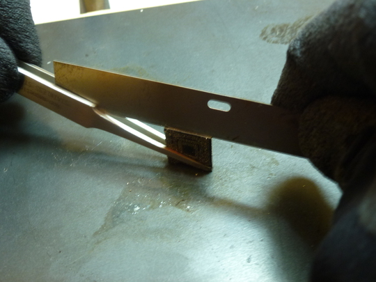
 <figcaption aria-hidden="true">14-Separation.jpg</figcaption>
                                                                      
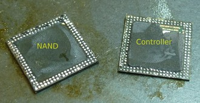
<figcaption aria-hidden="true">15-Separated.jpg</figcaption>

4.  Using liquid flux, or flux paste and a soldering iron scrape the
    remaining epoxy off the NAND and clean it up real nice to prep for a
    NAND read.

 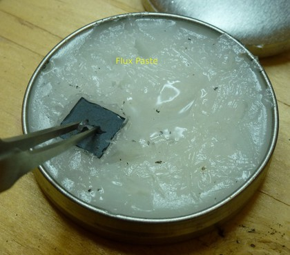
 <figcaption aria-hidden="true">16-1-SolderCleanup.jpg</figcaption>
                                                                      
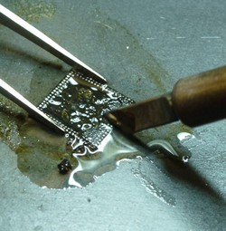
<figcaption aria-hidden="true">16-2-SolderCleanup.jpg</figcaption>
                                                                                                                                           
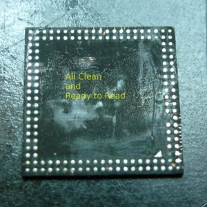
<figcaption aria-hidden="true">17-AllClean.jpg</figcaption>