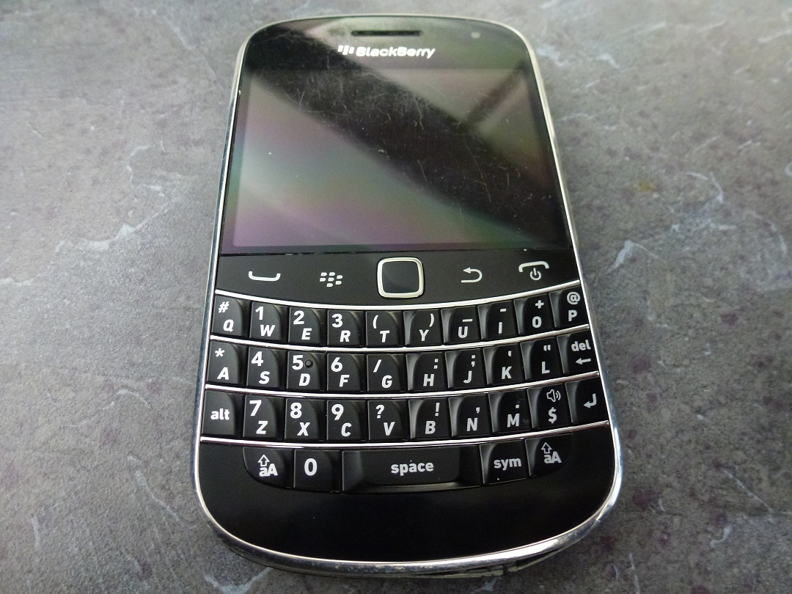
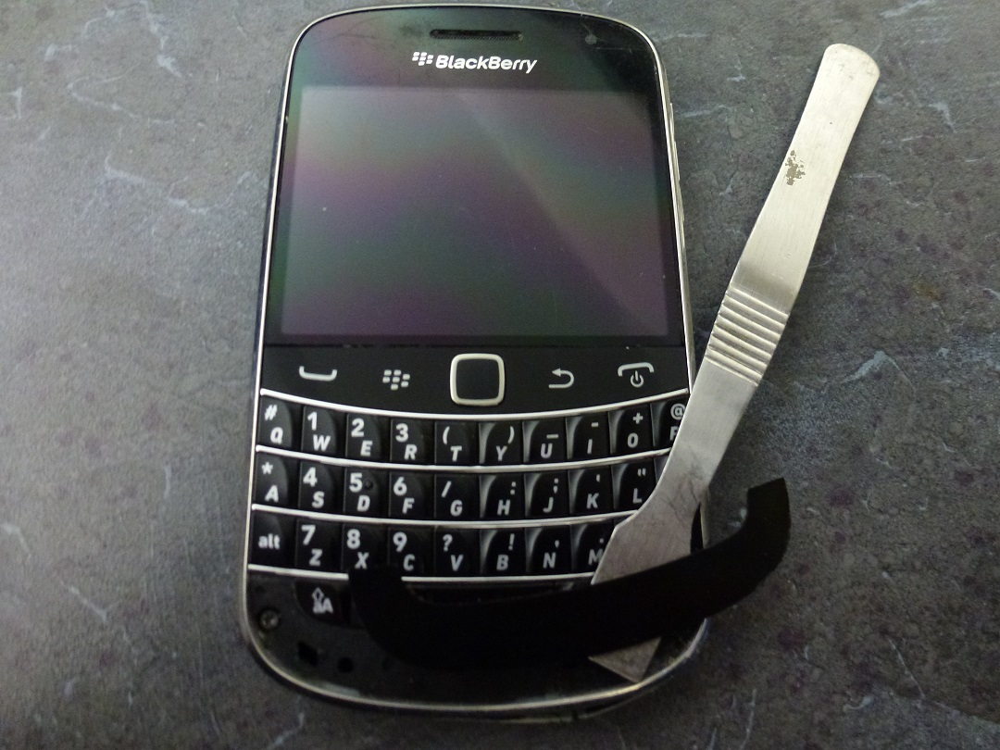
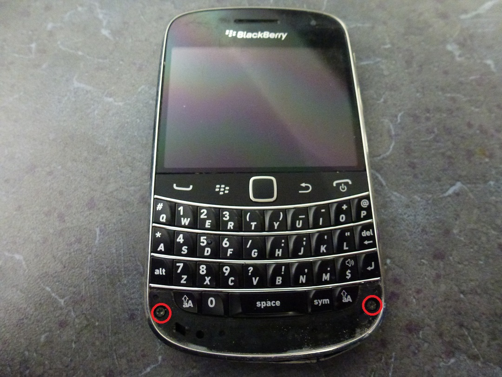
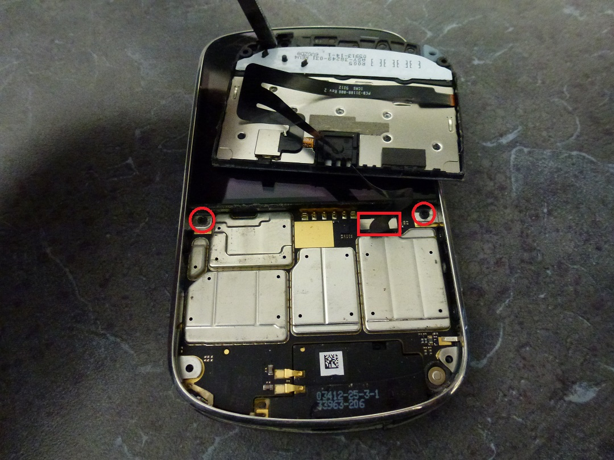
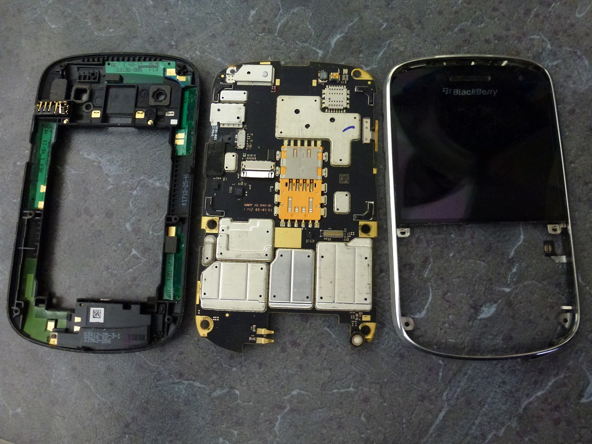
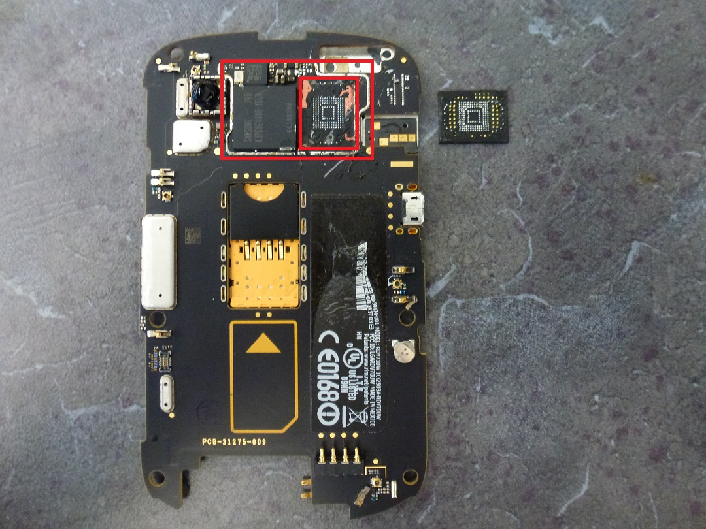
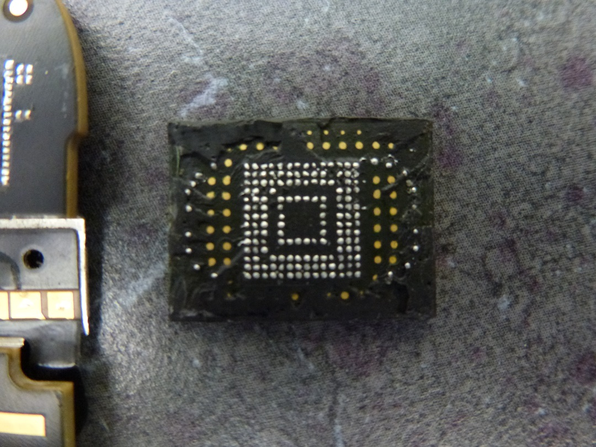

---
tags:
  - Mobile 
---
## Tear Down

 
 <figcaption aria-hidden="true">19900.JPG</figcaption>

1.  Remove the bottom bezel from the face of the phone. Then remove the
    two T5 screws.

 
 <figcaption aria-hidden="true">29900.JPG</figcaption>
 
 
 <figcaption aria-hidden="true">39900.JPG</figcaption>

2.  Pry the keyboard up from the bottom, and remove from phone. There is
    a ribbon cable attached underneath.

 
 <figcaption aria-hidden="true">49900.JPG</figcaption>

3.  Remove the two T5 screws at the bottom of the screen, and slide the
    screen downward to expose two more T5 screws at the top of the
    phone.

 
 <figcaption aria-hidden="true">59900.JPG</figcaption>

4.  With 6 total screws removed, the backing and case will come apart,
    and the mainboard can be removed.

 
 <figcaption aria-hidden="true">69900.JPG</figcaption>

5.  The NAND will be top-centre of the rear of the board (Camera/SIM
    side).

 
 <figcaption aria-hidden="true">79900.JPG</figcaption>

6.  Apply appropriate heat to remove the shield and the chip underneath.
    There will be epoxy on the chip so take your time, use adequate heat
    and gently remove the chip from the board. From personal experience,
    the 9900 has the highest failure rate for chip-off due to this epoxy
    ruining traces at the edges/corners of the chip when removing from
    the board, or during clean up.

 
 <figcaption aria-hidden="true">89900.JPG</figcaption>

8.  The chip is now ready to be read. The chip in our test phone is a
    SanDisk SDIN5C2-8G. It was read using a Sireda 12x16_0.5 adapter.
    The resulting .dd was parsed in UFED Physical Analyzer.