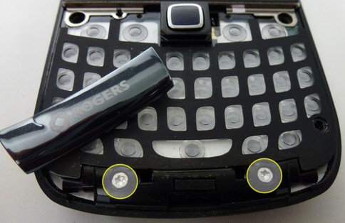
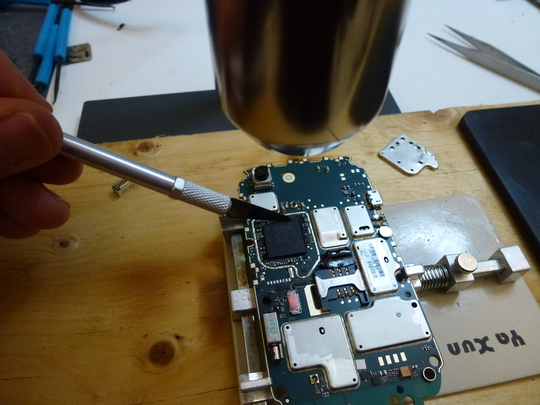
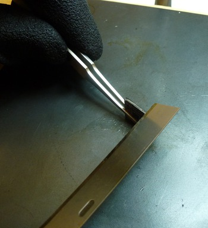
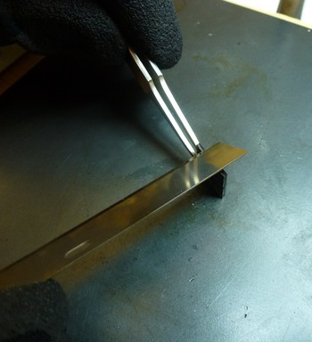
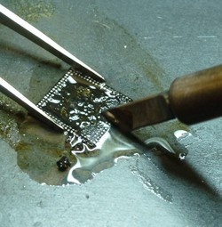

---
tags:
  - Mobile 
---
## Tear Down

1.  Remove the back panel.
2.  Remove the SIM and SD Memory Card.
3.  Using a torx-6 screw driver remove the 2 visible screws on the back
    of the phone.

 
 <figcaption aria-hidden="true">1-ScrewRemoval.jpg</figcaption>

4.  Remove the screen protector using a plastic shim or guitar pick.

 
 <figcaption aria-hidden="true">2-PlasticScreen.jpg</figcaption>

5.  Use the shim to detach the top-plate/cover from the device.

 
 <figcaption aria-hidden="true">3-TopPlate.jpg</figcaption>

6.  Remove 4 additional torx-6 screws.

 
 <figcaption aria-hidden="true">4-ScrewRemoval.jpg</figcaption>

7.  Detach vendor plate and remove 2 more torx-6 screws.

 
 <figcaption aria-hidden="true">5-ScrewRemoval.jpg</figcaption>

8.  Separate back plate from the main board.

 
 <figcaption aria-hidden="true">6-SeperateBoard.jpg</figcaption>

9.  The tear down is now complete

 
 <figcaption aria-hidden="true">7-TearDownComplete.jpg</figcaption>

## NAND Removal

1.  Peel off the vendor sticker on the back side of the main circuit
    board
2.  The NAND is located beneath the heat shield directly above the Micro
    SD card slot.

 
 <figcaption aria-hidden="true">8-NAND-Location.jpg</figcaption>

3.  Place the main board in a stand or holder and position it under a
    heat gun or device the blows super hot air. We use a Wagner "model
    XYZ" positioned approximately 2 1/2" - 3" inches away from the main
    board.

 
 <figcaption aria-hidden="true">9-Positioning.jpg</figcaption>

4.  Monitoring the temperature the heat shield will come off easily
    between 190-200 Centigrade.

 
 <figcaption aria-hidden="true">10-Temperature.jpg</figcaption>

<figcaption aria-hidden="true">11-HeatSheildRemoved.jpg</figcaption>

5.  Continue working under the high heat. In the 9300's I've worked on
    there is typically a black epoxy that has been applied to the NAND.
    Using a razor under the high heat this epoxy can be easily cut into.
    Once the epoxy has been cut and with the temperature around 215
    Centigrade the NAND will be easily removed from the main board.

 
 <figcaption aria-hidden="true">12-NANDRemoval.jpg</figcaption>

The BlackBerry Curve 9300 uses a stacked die 152 pin BGA, this includes
a NAND stacked on a controller which is soldered to the main board. We
are interested in the NAND and therefore must separate it from the
controller. This is accomplished with the use of high heat (heat gun), a
20 x 20 x 0.5cm steel plate and a 10cm razor blade.

6.  Position the steel plate under the heat gun. The plate will heat up
    and hold the heat, try not to burn yourself.
7.  Transfer the NAND+Controller to the plate and allow the chip to take
    in some heat \~1min.
8.  Using long tweezers to hold the chip and the 10cm razor begin
    slicing away the epoxy that is surrounding the chip with a sharp
    razor the epoxy will slice easily allowing you to see a tiny gap
    between the NAND and the controller.

 
 <figcaption aria-hidden="true">13-3-EpoxyCleanup.jpg</figcaption>
                                                                     

<figcaption aria-hidden="true">13-4-EpoxyCleanup.jpg</figcaption>
                                                                                                                                         

<figcaption aria-hidden="true">13-5-EpoxyCleanup.jpg</figcaption>
 
 
 <figcaption aria-hidden="true">13-1-EpoxyCleanup.jpg</figcaption>

<figcaption aria-hidden="true">13-2-EpoxyCleanup.jpg</figcaption>

9.  The razor can then be used to separate the two.

 
 <figcaption aria-hidden="true">14-Separation.jpg</figcaption>

<figcaption aria-hidden="true">15-Separated.jpg</figcaption>

10. Using liquid flux, or flux paste and a soldering iron scrape the
    remaining epoxy off the NAND and clean it up real nice to prep for a
    NAND read.

 
 <figcaption aria-hidden="true">16-1-SolderCleanup.jpg</figcaption>
                                                                     

<figcaption aria-hidden="true">16-2-SolderCleanup.jpg</figcaption>
                                                                                                                                           

<figcaption aria-hidden="true">17-AllClean.jpg</figcaption>