---
tags:
  - Mobile
---
The hardware used in the BlackBerry 9315's and 9320's are almost
identical. The following link describes the differences between the
models.

## Tear Down

1.  Remove the back panel.

 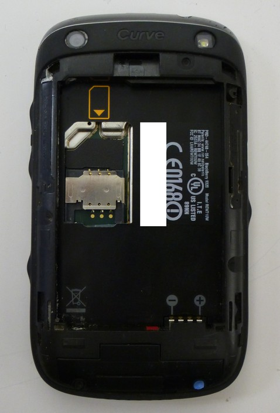
 <figcaption
 aria-hidden="true">1-bb9320-BackPanelRemoved.jpg</figcaption>

2.  Remove the SIM and SD Memory Card.

<!-- -->

3.  Using a torx-6 screw driver remove the 2 visible screws on the back
    of the phone.

 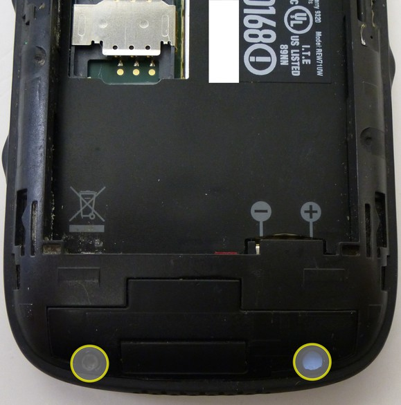
 <figcaption aria-hidden="true">2-bb9320-ScrewRemoval.jpg</figcaption>

4.  Remove the screen protector using a shim, guitar pick, or prying
    tool.

 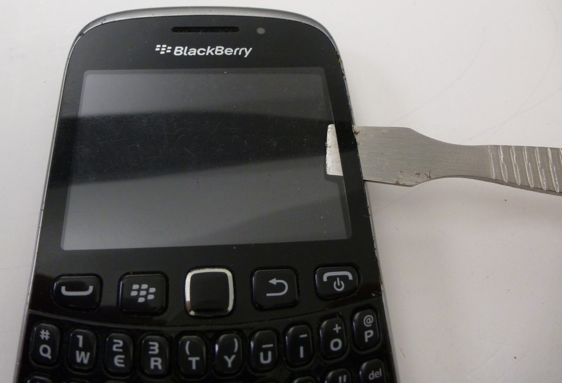
 <figcaption aria-hidden="true">3-bb9320-ScreenRemoval.jpg</figcaption>

5.  Remove 2 torx-5 screws.

 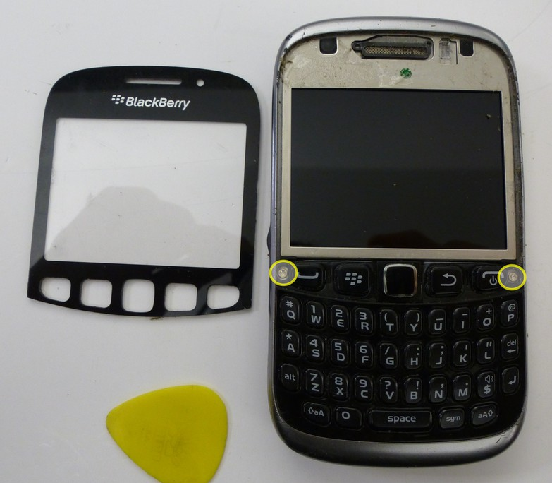
 <figcaption aria-hidden="true">4-bb9320-ScrewRemoval.jpg</figcaption>

6.  Use the shim to detach the outer bezel/keyboard from the device.

 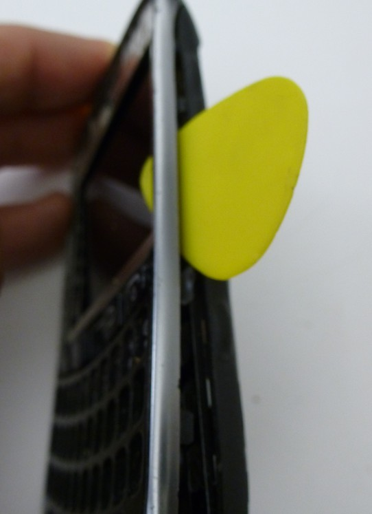
 <figcaption aria-hidden="true">5-bb9320-TopPlate.jpg</figcaption>
                                                                     
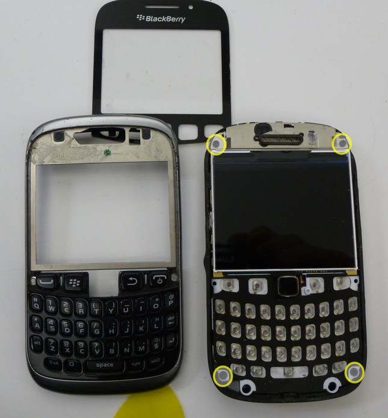
<figcaption aria-hidden="true">5-1-bb9320-TopPlate.jpg</figcaption>

7.  Remove 4 additional torx-6 screws. The main board will now easily be
    separated from the back plate

 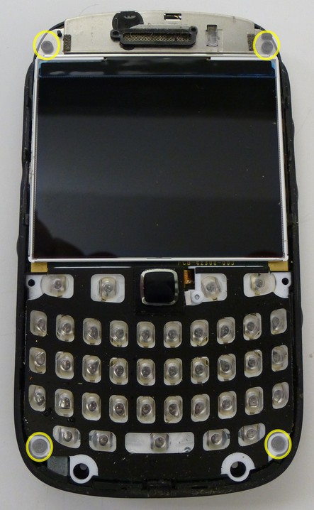
 <figcaption aria-hidden="true">6-bb9320-ScrewRemoval.jpg</figcaption>

8.  Peel off the vendor sticker.

 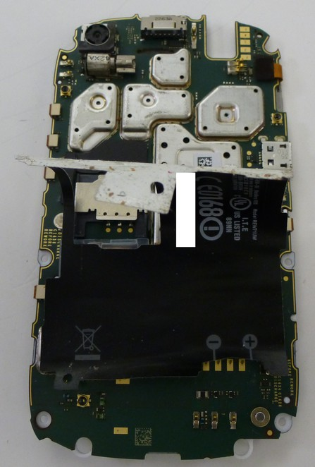
 <figcaption aria-hidden="true">7-bb9320-VendorPlate.jpg</figcaption>

9.  Remove the plastic cover protecting the track pad ribbon cable, and
    disconnect the track pad.

<!-- -->

10. Remove the final torx-4 screw located beneath the plastic protector,
    to remove the plastic keyboard overlay.

 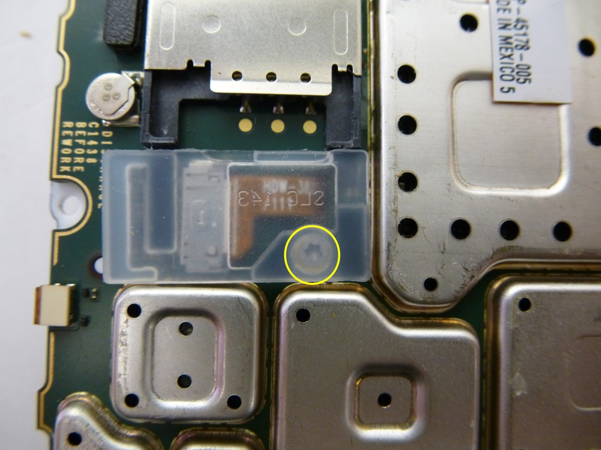
 <figcaption aria-hidden="true">8-bb9320-ScrewRemoval.jpg</figcaption>

11. Disconnect the ribbon cable connected to the LCD. Then using a pick
    separate the display from the main board.

 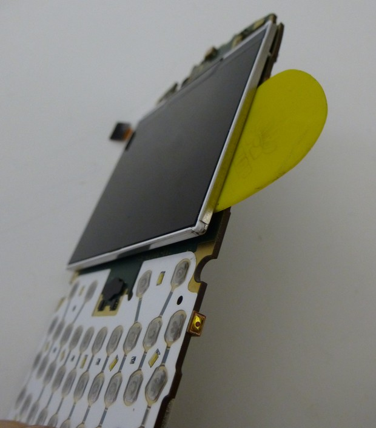
 <figcaption aria-hidden="true">9-bb9320-ScreenRemoval.jpg</figcaption>

12. The tear down is now complete

 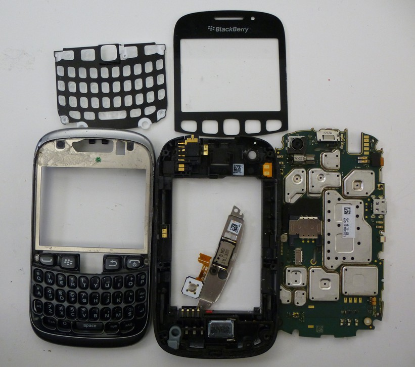
 <figcaption
 aria-hidden="true">9-1-bb9320-TearDownComplete.jpg</figcaption>

eMMC Removal

1.  The eMMC is located beneath the heat shield directly above the Micro
    SD card slot.

 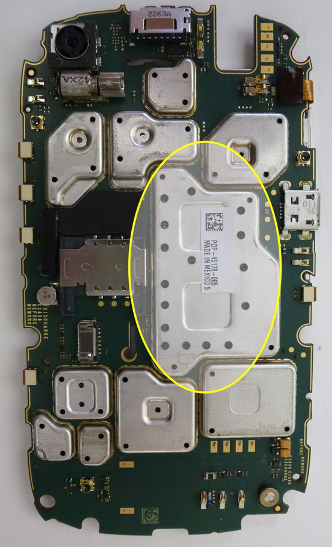
 <figcaption aria-hidden="true">10-bb9320-EMMC-Location.jpg</figcaption>

2.  Place the main board in a stand or holder and position it
    approximately 2 1/2" - 3" inches away from a heat gun or device the
    blows super hot air.

 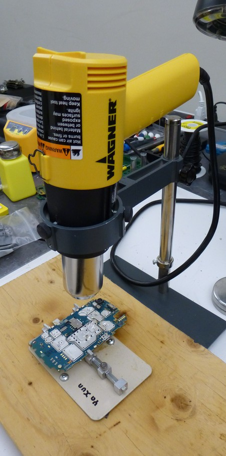
 <figcaption aria-hidden="true">11-bb9320-HeatShield.jpg</figcaption>

3.  Monitoring the temperature the heat shield will come off easily
    between 190-200 Centigrade.

 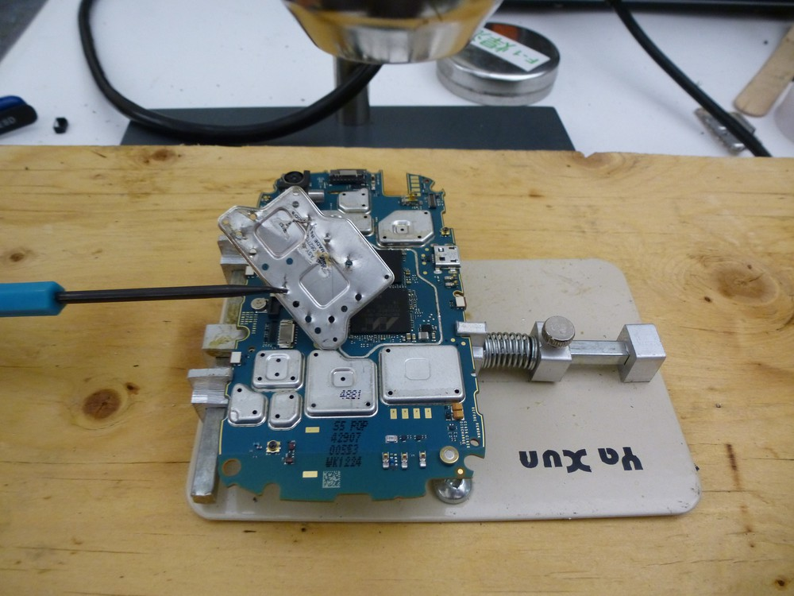
 <figcaption aria-hidden="true">12-bb9320-HeatShield.jpg</figcaption>

<figcaption
aria-hidden="true">13-bb9320-HeatShieldRemoved.jpg</figcaption>

4.  Continue working under the high heat. With the 9315/9320's I've
    worked on the eMMC has been ready to lift off of the main board
    using tweezers immediately after removing the heat shield.

 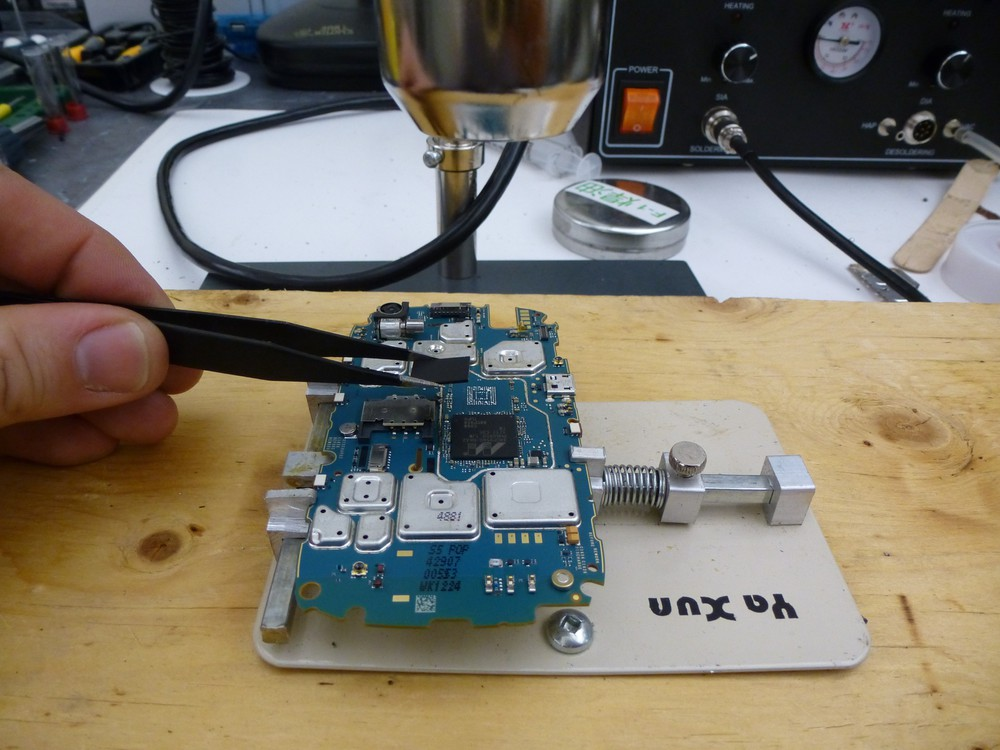
 <figcaption aria-hidden="true">14-bb9320-EMMC-Removed.jpg</figcaption>

5.  Using liquid flux, or flux paste and a soldering iron clean the pads
    on the eMMC in preparation for a read

 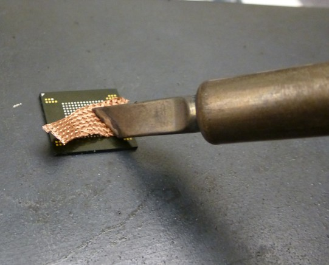
 <figcaption aria-hidden="true">15-bb9320-EMMC-Cleanup.jpg</figcaption>

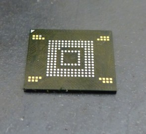
<figcaption aria-hidden="true">16-bb9320-EMMC-Clean.jpg</figcaption>

6.  The eMMC is now ready to read using the appropriate
    adapter/programmer and software.

At the time of this writing (2013OCT29) the eMMC that was removed in
this example was read using an UP828 programmer via the "VBGA169E"
adapter and using the "eNAND_H9DP4GG4JJACGR-4EM/459MB" device settings.
The resulting image was then parsed via the CelleBrite Physical Analyzer
(V. 3.8.5.108).
