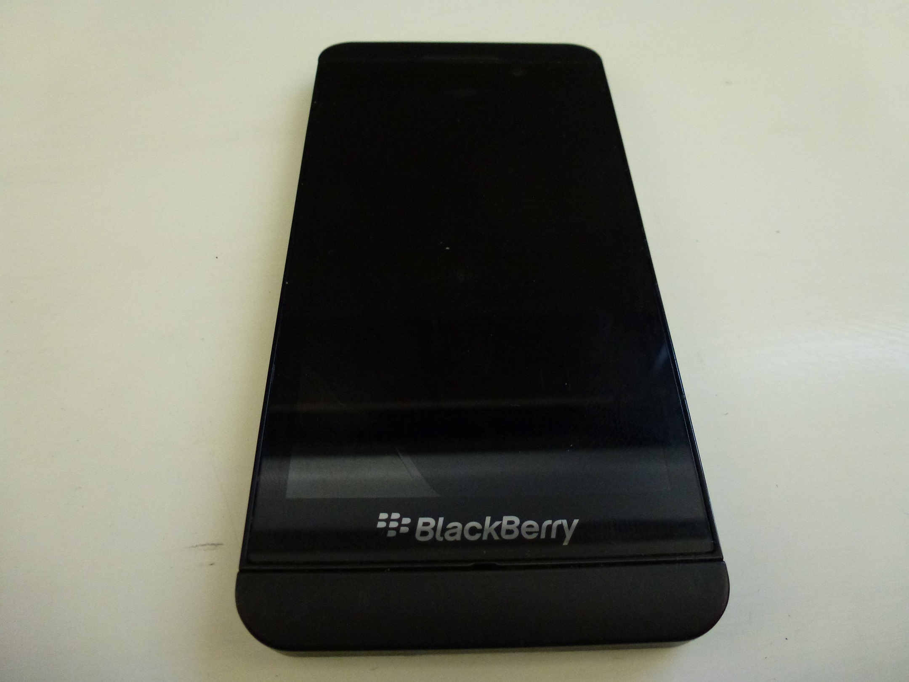
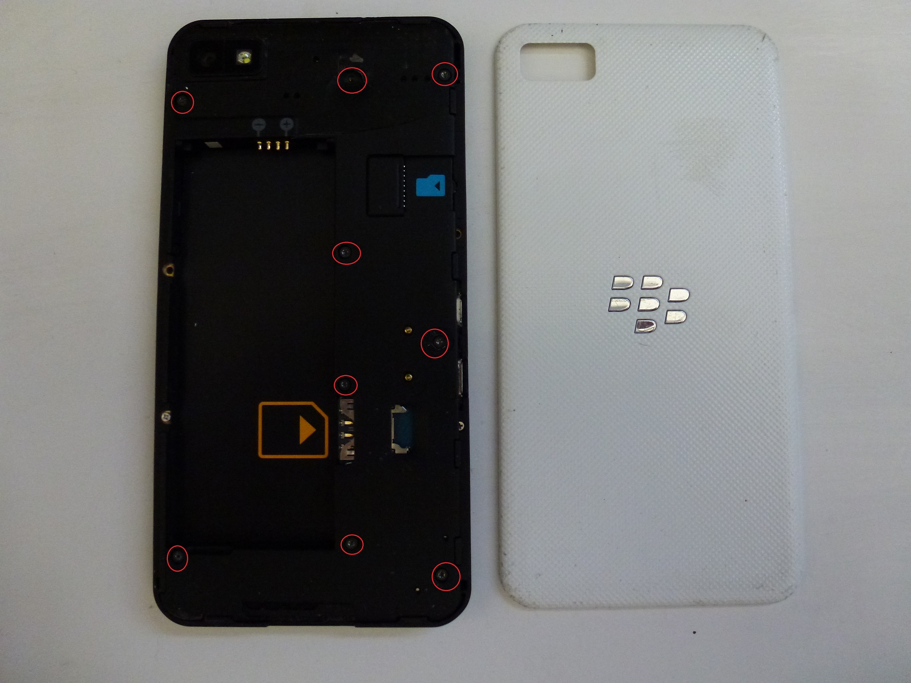
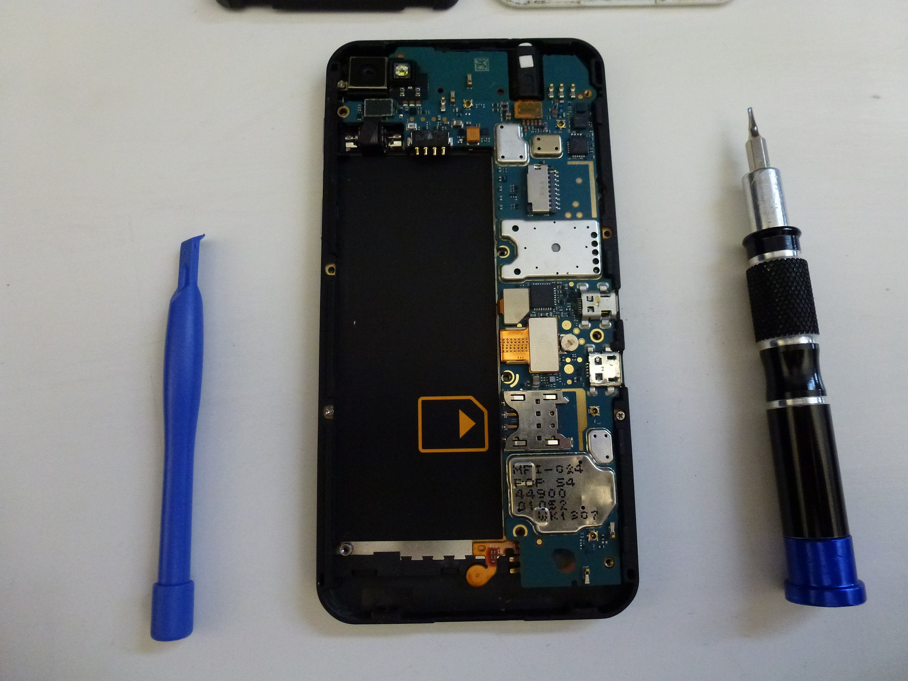
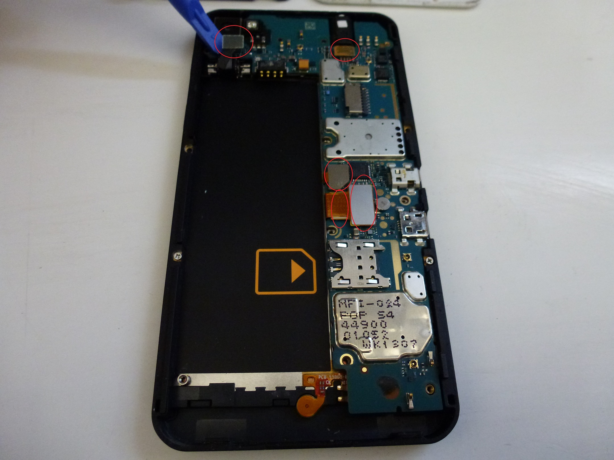
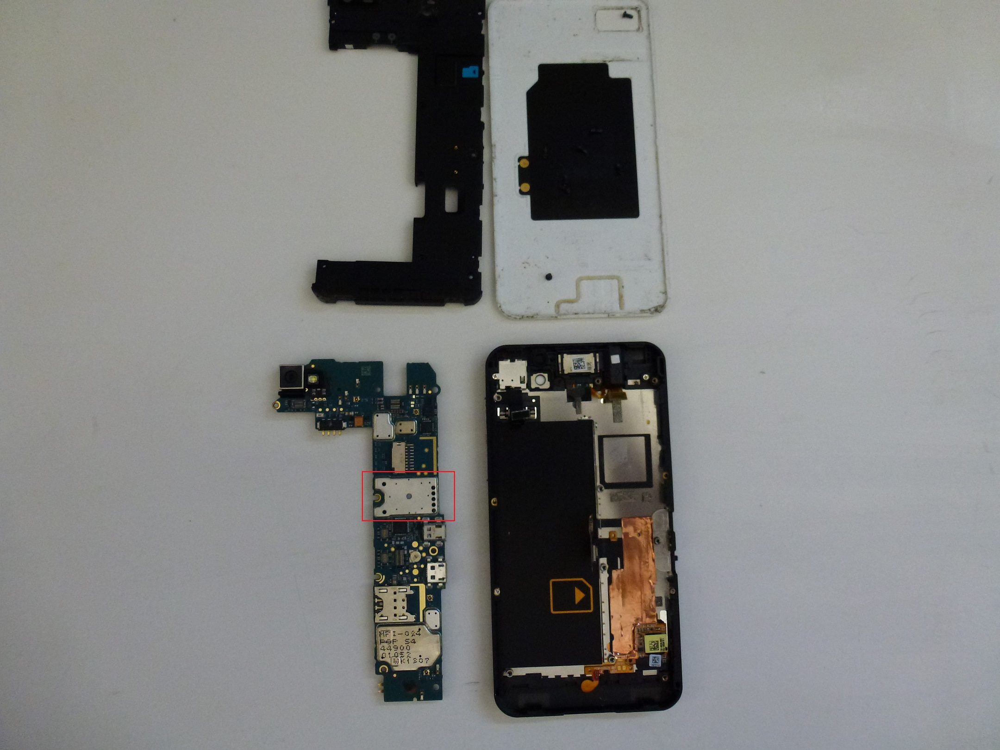
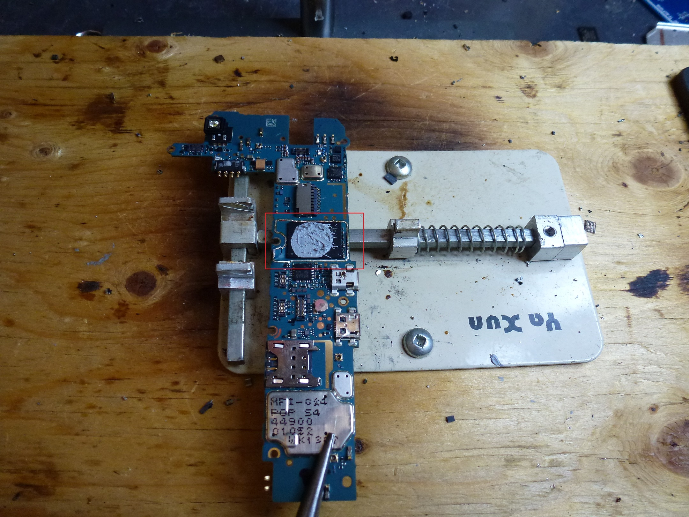
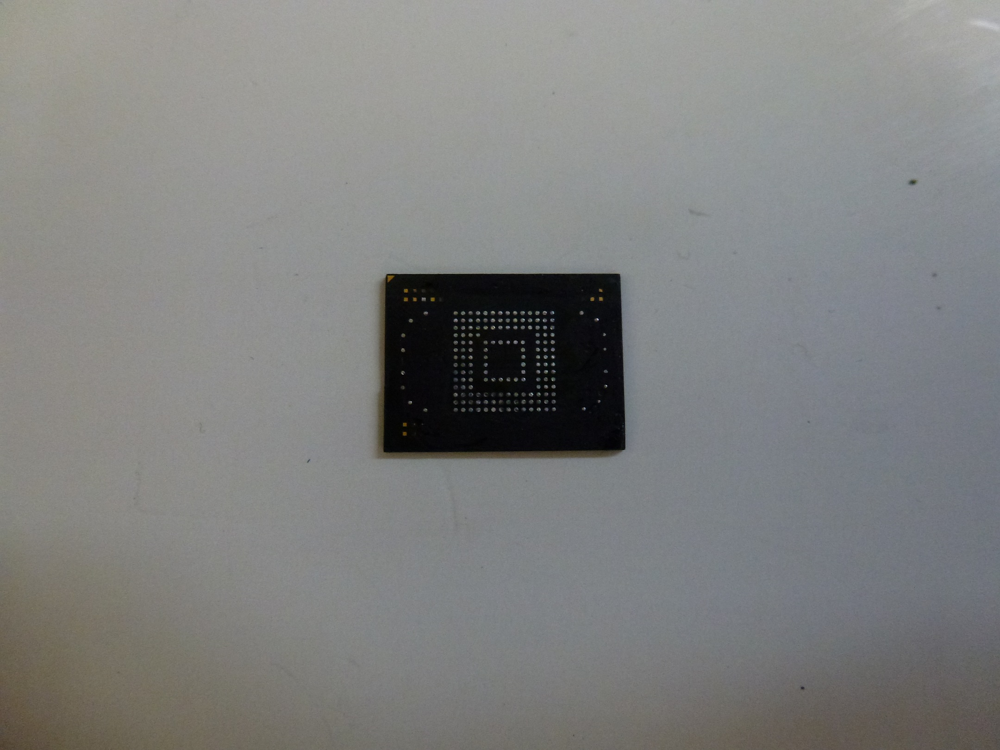
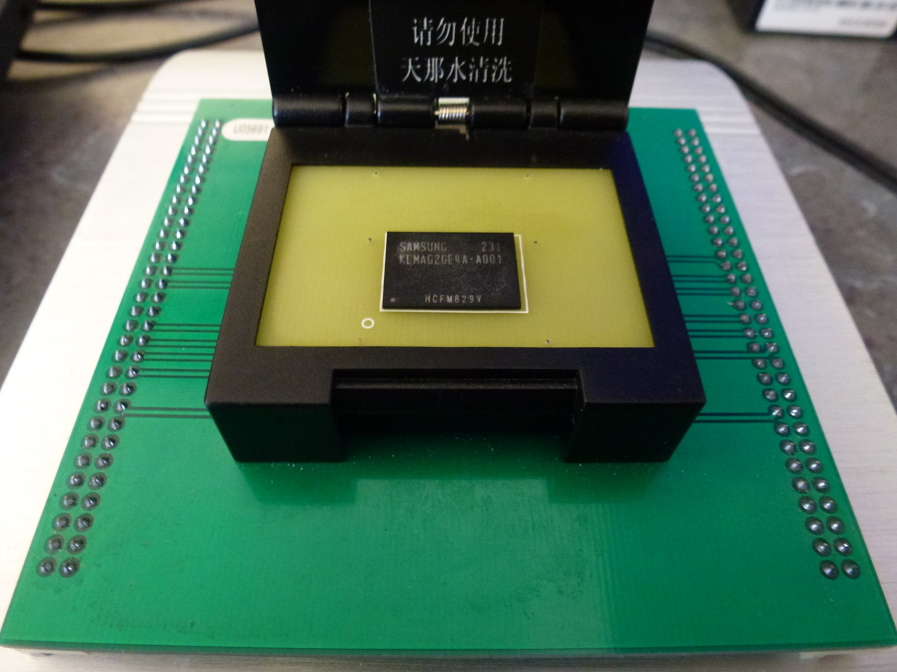

---
tags:
  - Mobile 
---
## Tear Down

 
 <figcaption aria-hidden="true">1Z10.JPG</figcaption>

1.  Remove the back panel.

<!-- -->

2.  Remove the Battery, SIM and SD Memory Card.

<!-- -->

3.  Using a torx-4 screw driver, remove the visible screws on the back
    of the phone.

 
 <figcaption aria-hidden="true">2Z10.JPG</figcaption>

4.  Un-clip the back panel using a shim, guitar pick, or prying tool.
    This will expose the mainboard.

 
 <figcaption aria-hidden="true">3Z10.JPG</figcaption>

5.  Un-clip all connectors (5) from the mainboard, and simply lift the
    board out of the phone.

 
 <figcaption aria-hidden="true">4Z10.JPG</figcaption>
                                                                      

<figcaption aria-hidden="true">5Z10.JPG</figcaption>

6.  Remove the shield to expose the memory module. There will be epoxy
    on the chip so take your time, use adequate heat, and gently remove
    the chip from the board.

 
 <figcaption aria-hidden="true">6Z10.JPG</figcaption>

7.  Prepare the chip for reading. Again, take your time to carefully
    remove the epoxy without applying too much direct heat, and
    consistently adding flux paste.

 
 <figcaption aria-hidden="true">7Z10.JPG</figcaption>

8.  The chip is now ready to be read. The chip in our test phone is a
    Samsung KLMAG2GE4A-A001. It was read using an UP-828 Programmer with
    the VBGA169E adapter. The resulting .bin was parsed in UFED Physical
    Analyzer.

 
 <figcaption aria-hidden="true">8Z10.JPG</figcaption>