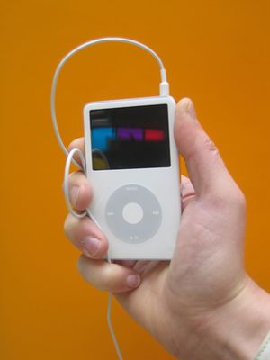

---
tags:
  - Hardware
  - Personal Devices
---

The **iPod** is a brand of portable digital media player designed and
marketed by [Apple Computer](apple_computer.md). Devices in the
iPod family provide a simple user interface designed around a central
scroll wheel (with the exception of the iPod shuffle). The standard iPod
model stores media on a built-in hard drive, while the smaller iPod
shuffle and iPod nano use [flash memory](flash_memory.md). Like
most digital audio players, an iPod can serve as an external [data
storage](data_storage.md) device when connected to a
[computer](computer.md).

## Software Capabilities

The iPod can play [MP3](mp3.md), [WAV](wav.md), [M4A/AAC
LC](m4a/aac_lc.md), [Protected AAC](protected_aac.md),
[AIFF](aiff.md), Audible audiobook and Apple Lossless audio file
formats. The fifth-generation iPod can also play .m4v and .mp4
[MPEG-4](mpeg-4.md) video file
formats. The [Microsoft Windows](microsoft_windows.md) version
of [iTunes](itunes.md) can transcode regular non copy-protected
[WMA](wma.md) files to an iPod supported format. WMA files with
copy protection cannot be played in iTunes or be copied to an iPod.
Reviewers have criticized the iPod's inability to play some other
formats, in particular the [Ogg Vorbis](ogg_vorbis.md) and
[FLAC](flac.md) formats. [MIDI](midi.md) files cannot be
played on iPods, but can be converted into a compatible audio file
format by choosing the "advanced" menu on iTunes.

Apple designed the iPod to work with the iTunes media library software,
which lets users manage the music libraries on their computers and on
their iPods. iTunes can automatically synchronize a user's iPod with
specific playlists or with the entire contents of a music library each
time an iPod connects to a host computer. Users may also set a rating
(out of 5 stars) on any song, and can synchronize that information to an
iTunes music library. Apart from iTunes there are also several
third-party applications available that can be used to transfer songs to
the iPod. iTunes lacks the ability to transfer songs from iPod to
computer because of legality issues, although there are third party
programs that circumvent Apple's protection.

In addition to playing music and storing files, the iPod has limited
PDA functionality. Since January 2003, Mac users have
been able to synchronize their contacts and schedules Address Book and
[iCal](ical.md) to their iPods through
[iSync](isync.md). With the 2005 release of iTunes 5.0, Apple
integrated contact/schedule syncing into iTunes and added the ability
for Windows users to synchronize their contacts and schedules from
[Microsoft Outlook](microsoft_outlook.md) and [Outlook
Express](outlook_express.md). Although Mozilla Calendar and
Mozilla Sunbird iCalendar have the same file format used by iCal and the
iPod, there is no way to automatically sync schedules among these
programs. However the files can be manually dragged and dropped into the
correct directory on the iPod.

The limited PDA calendar functions of the iPod are somewhat tainted for
users from Newfoundland and parts of Australia. Their time zones are
excluded from the iPod's firmware, leaving them unable to properly sync
calendar events and alarms to their devices. No workaround (including
mentally converting times when reading them) is functionally acceptable
due to the combined behaviours of iSync, iCal and the iPod with regards
to converting events between time zones. Apple has yielded no commitment
to correct this problem as of January,2006.

iPod can also display notes, and hence host simple games and store
restaurant information. However, iPod has limitations as a PDA, since
users cannot edit this information on the iPod except through a
computer.

## Models

Apple currently markets three distinct players bearing the iPod name.
Some models come with different capacities (a higher capacity allows the
storage of more music) or with different designs. The model range as of
February 7, 2006 includes:

- iPod (30 GB and 60 GB).
- iPod nano (1 GB, 2 GB, and 4 GB).
- iPod shuffle (512 MB and 1 GB).

### iPod

#### First Generation

#### Second Generation

#### Third Generation

#### Fourth Generation

#### Fifth Generation

### iPod Mini

### iPod Shuffle

### iPod Nano

### iPod Touch

#### First Generation

#### Second Generation

## External Links

- [Official website](http://www.apple.com/ipod/)
- [iPodLinux project website](http://ipodlinux.org) - Contains lots of
  useful information about the iPod hardware and software.
