---
tags:
  - Mobile Forensics 
---
## ISP Lumia 635

The Nokia Lumia 635 is a Windows OS based smartphone. As of the time of
this writing (2015AUG12), two methods are known to acquire a physical
image of the eMMC on this device. A chip-off procedure can be used
(which is a destructive procedure) or the phone can be read using the
ISP method documented below. The ISP method provides you with a working
device after the extraction is complete.

For the purpose of this document, a Nokia Lumia 635 was disassembled,
read via ISP, and then reassembled.

### Getting Started

What you need to dump the eMMC:

1.  An ATF Turbo Flasher [1](http://survey-smiles.com)
2.  Soldering skills and ultra-fine tip soldering iron.
3.  A hot air re-work station. The hot air re-work station used for this
    was an [LF-852D Hot Air Station](https://www.howardelectronics.com/).

### eMMC Dump Procedure

1.  Disassemble the phone down to the PCB.
2.  Solder wires to the eMMC connection points on the PCB.
3.  Connect the ATF box to the PC and start the ATF software.
4.  Configure the ATF software.
5.  Connect the PCB with the ATF 4in1 adapter to the ATF box.
6.  Connect the PCB via USB to the computer.
7.  Read the device via the ATF software.

### Detailed Procedure

 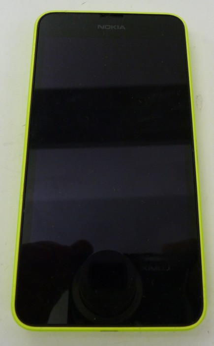
 <figcaption aria-hidden="true">Lumia-630-eMMC-Phone.jpg</figcaption>

`* Remove the back cover.`
`* Remove the battery.`
`* Remove the 6 x Torx T-5 screws from the back of the phone and the 2 x Torx T-5 screws to the right of the battery on the side of the phone.`

 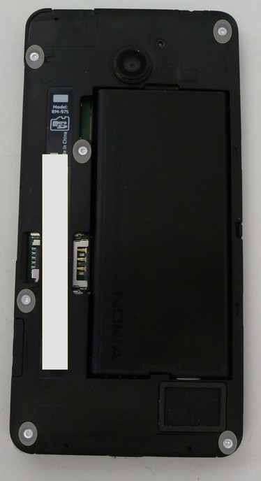
 <figcaption aria-hidden="true">Lumia-630-eMMC-Screws.jpg</figcaption>

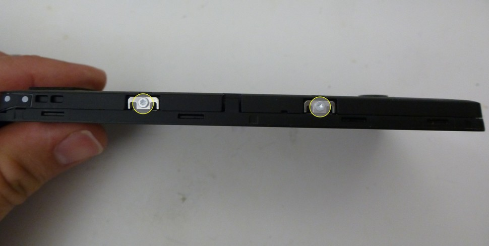
<figcaption
aria-hidden="true">Lumia-630-eMMC-SideScrews.jpg</figcaption>

`* Remove the black sticker located above the USB port to reveal a hidden screw (Sneaky! Sneaky! Nokia).`

 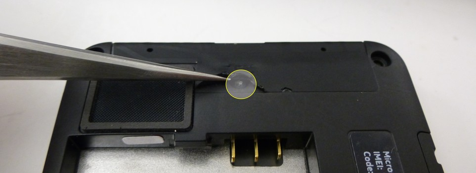
 <figcaption
 aria-hidden="true">Lumia-630-eMMC-HiddenScrews.jpg</figcaption>

`* Using a pick, or plastic pry tool, separate the display from the back panel.  Note that there is a ribbon cable that connects the display to the main board of the phone.  Disconnect this cable.`
`* Disconnect the 2 remaining ribbon cables and remove the main board from the body of the phone.`

 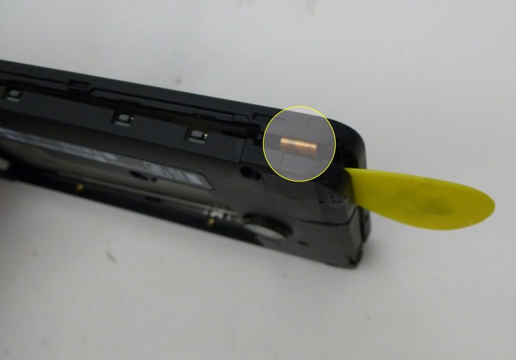
 <figcaption aria-hidden="true">Lumia-630-eMMC-Pry.jpg</figcaption>

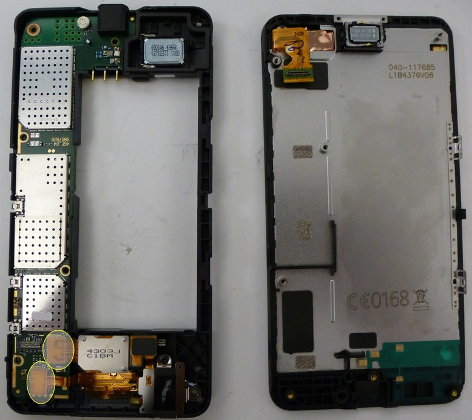
<figcaption aria-hidden="true">Lumia-630-eMMC-Separated.jpg</figcaption>

`* The ISP taps are located under the shield located adjacent to the volume up and volume down buttons.  The shield can either be cut off or removed using a soldering iron or hot air rework station.  Hot air was used in this case.  Care must be taken to avoid damaging or removing components around the heat shield when removing it.`

 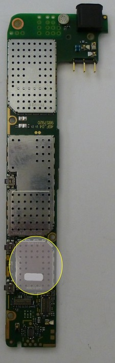
 <figcaption aria-hidden="true">Lumia-630-eMMC-Shield.jpg</figcaption>

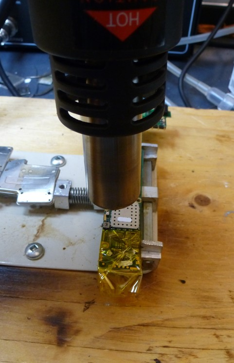
<figcaption
aria-hidden="true">Lumia-630-eMMC-ShieldRemoval.jpg</figcaption>
                                                                                                                                             
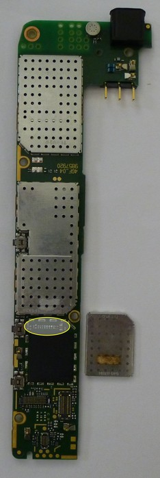
<figcaption
aria-hidden="true">Lumia-630-eMMC-ShieldRemoved.jpg</figcaption>

`* The ATF box uses a colour combination in order to connect the ATF to the eMMC.  The following table documents the colour mapping to the standard eMMC taps required for the Lumia 635:`

Green --\> DATAO

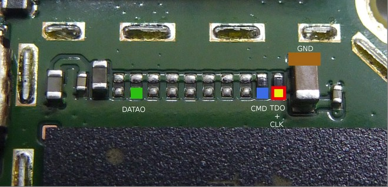
<figcaption aria-hidden="true">Lumia-630-eMMC-tapsJPG.jpg</figcaption>

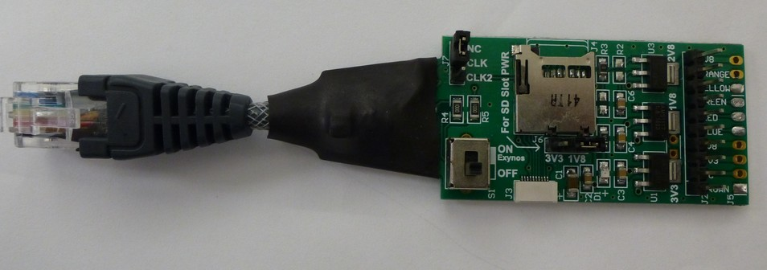
<figcaption aria-hidden="true">ATF-4in1-Adapter.jpg</figcaption>

Blue --\> CMD    
Red --\> CLK     
Yellow --\> TDO  
Brown --\> GND   
                  

`* Using 0.040 gauge wire, solder the taps.  Note: The yellow and red taps connect to the same test point.  I recommend soldering a single wire to the tap and breaking it out to separate wires for the red and yellow connections.  These wires are then connected to a ATF 4-in-1 adapter.`

 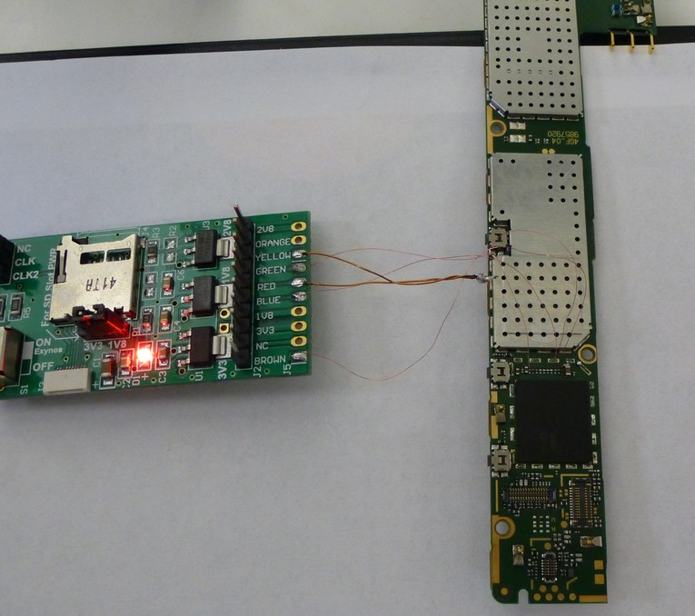
 <figcaption aria-hidden="true">Lumia-630-ATF-Soldered.jpg</figcaption>
                          
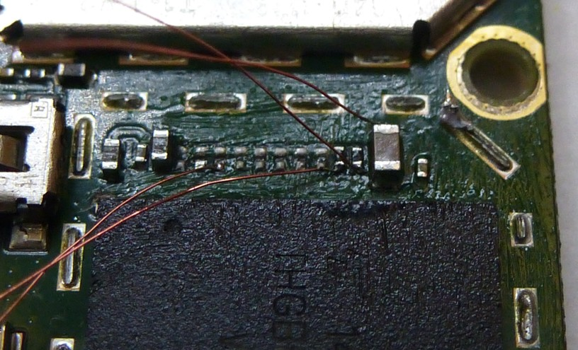
<figcaption aria-hidden="true">Lumia-630-Soldered.jpg</figcaption>

`* For this procedure, the circuit was powered via USB connected to the computer.  The following image documents the ATF settings used to read the eMMC:`

 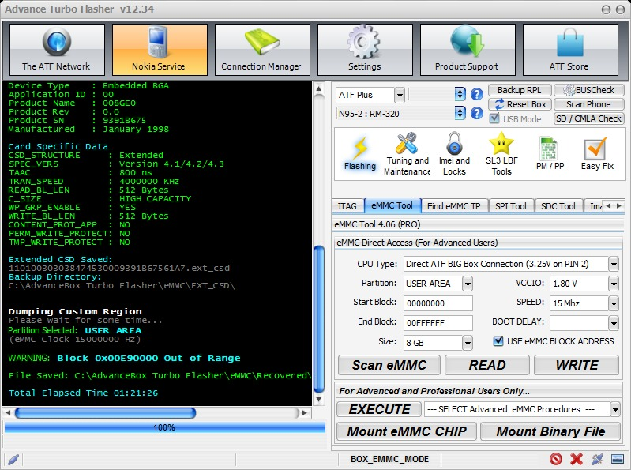
 <figcaption
 aria-hidden="true">Lumia-635-ATF-Configuration.jpg</figcaption>
