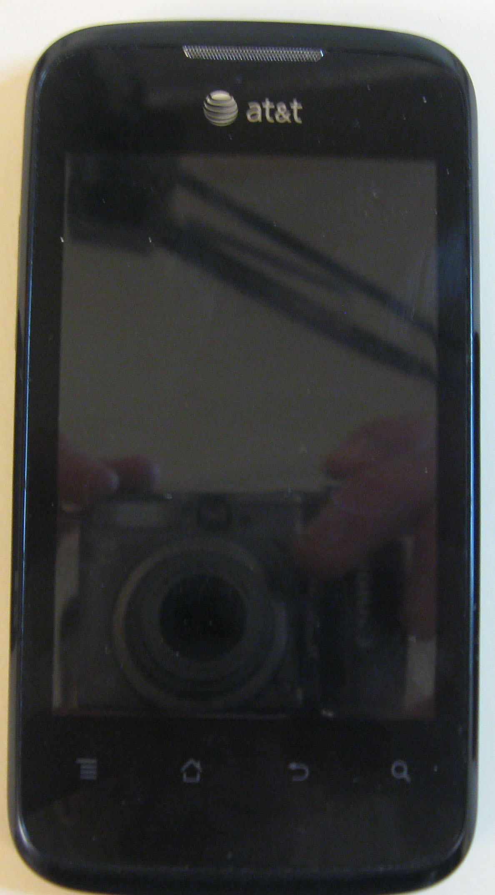
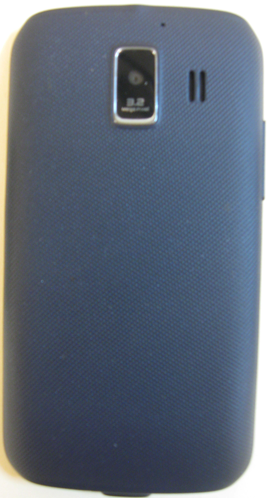
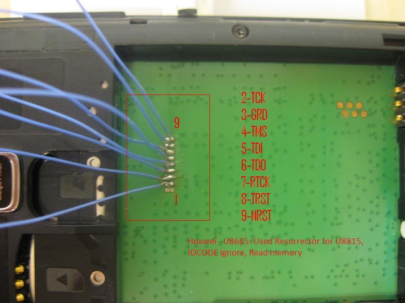
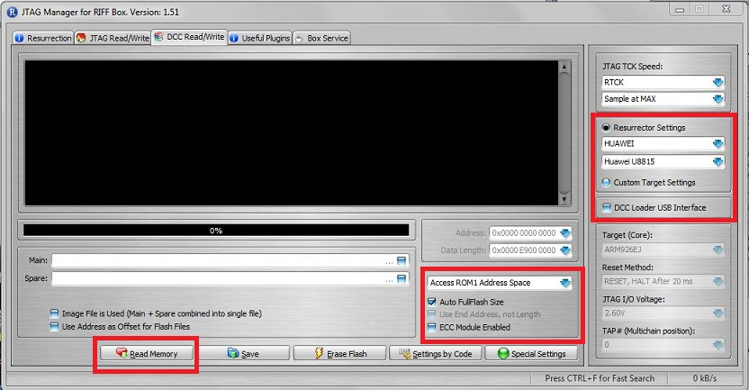
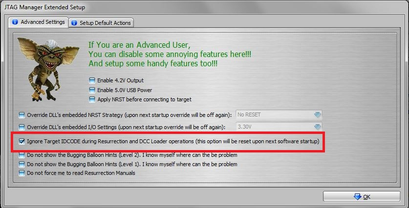

---
tags:
  - Mobile
---
### JTAG Huawei U8655 Fusion II

This phone is supported by the At&t network. This uses a Qualcomm 7225A
800 MHz Processor and comes standard with Android version 2.3. This
phone is unsupported by RIFF Box for the JTAG process for resurrector.
The phone has 4gb Samsung KMSJS000KM-B308 MoviNAND flash memory.
 
 
 <figcaption aria-hidden="true">huawei-u8655-front.jpg</figcaption>

<figcaption aria-hidden="true">huawei-u8655-back.jpg</figcaption>

### Getting Started

What you need:

1.  Riff Box
2.  USB to Micro USB cord

### NAND Dump Procedure

1.  Remove battery and peel the phone label from the board.
2.  Connect the RIFF box to the PC via USB.
3.  Connect the RIFF box to the PCB via the JTAG pins.
4.  Connect the PCB to a Micro USB cord and power via a power supply.
5.  Start the "RIFF box" software.
6.  Power the PCB.
7.  Dump the NAND.

The TAPS are located under the battery, behind the Huawei phone label.
The phone will be powered by a Micro USB cord from an AC battery
charger.

The TAPS order is as follows:

1.  1=Not Used
2.  2=TCK
3.  3=GND
4.  4=TMS
5.  5=TDI
6.  6=TDO
7.  7=RTCK
8.  8=TRST
9.  9=NRST

 
 <figcaption aria-hidden="true">Huawei_u8665_taps.JPG</figcaption>

After the wires are connected to the board, the phone is powered by the
USB connection. Plug the Micro USB into the USB connection on the device
and then plug the phone into a wall outlet. The phone should respond
with the vibrator switch activating for less than a second.

Launch the Riff Box JTAG Manager and use the following settings:

- JTAG TCK Speed = RTCK
- Resurrector Settings= Huawei U8815
- Auto FullFlash size

 
 <figcaption aria-hidden="true">Huawei_U8665_setting.JPG</figcaption>

Advanced Settings:

- Ignore Target IDCODE during Resurrection and DCC Loader operations

 
 <figcaption aria-hidden="true">IDCODE.JPG</figcaption>

Then connect and get the ID, you should receive the dead body signal.
Then read the memory. JTAG complete.

### Notes

The phone has a 4Gb Movi flash memory chip which should take
approximately 30 minutes to download.

### References

- <https://www.phonescoop.com/phones/phone.php?p=3308>
