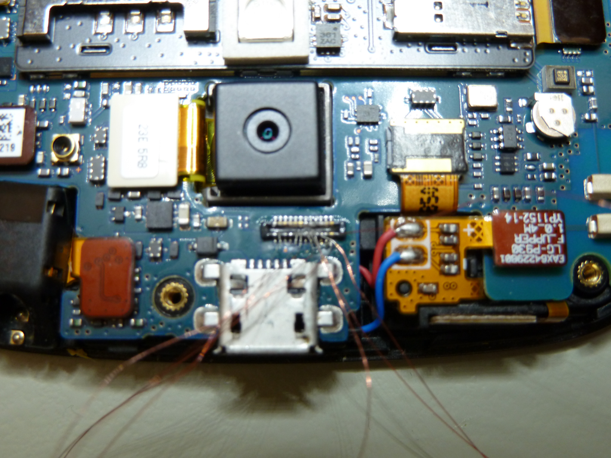

---
tags:
  - Mobile 
---
## JTAG LG P930 (Nitro HD)

The LG P930 (Nitro HD) is an Android based smartphone. At the time of
this writing (2013FEB07), I am unaware of any method to bypass the PIN,
password, or pattern locks on a LG P930 that is not rooted and does not
have ADB enabled. JTAG to the rescue! Using JTAG, a copy of the NAND can
be extracted, and the pin or pattern lock decoded from it.

For the purpose of this document, a LG P930 with a gesture pattern lock
was disassembled, read via JTAG, reassembled, and the pattern lock
removed.

### Getting Started

What you need to extract the lock from the device:

1.  A Octoplus JTAG Box with the latest Octoplus JTAG Manager software.
    The Octoplus JTAG Box used for this was purchased from GSM Server on
    eBay. Update: This device is now supported by the RIFF Box as well.
2.  Soldering skills and ultra-fine tip soldering iron (a JTAG jig may
    be available).
3.  A DC Power supply capable of supplying 3.8V/1.83A output. The power
    supply used for this was an Agilent U8002A DC Power Supply.
4.  PatternLockScripts from CCL Forensics
    ('GenerateAndroidGestureRainbowTable.py' and
    'Android_GestureFinder.py').

### NAND Dump Procedure

1.  Disassemble the phone down to the PCB.
2.  Connect the Octoplus JTAG Box to the PC via USB.
3.  Connect the Octoplus JTAG Box to the PCB via the JTAG pins.
4.  Connect the PCB to the DC power supply.
5.  Start the "Octoplus JTAG" software.
6.  Power the PCB.
7.  Dump the NAND.

Instructions for disassembly can be found on Internet but it can be
summarised as follows:

1.  Remove the rear cover and battery.
2.  Remove the 9 x Phillips screws.
3.  Split the phone case using a case opening tool (guitar pick).

 
 <figcaption aria-hidden="true">lg-p930-nitro-hd-front.png</figcaption>

<figcaption aria-hidden="true">lg-p930-nitro-hd-back.png</figcaption>

Once the phone has been disassembled, you can see the JTAG connection
port near the microUSB header. The connector used on the PCB is a
microminiature board-to-board Molex connectors. Molex sells the mating
heading under the brand name "SlimStack" however sourcing these headers
in small quantities can be difficult. In some cases, JTAG adapter jigs
can be purchased from companies such as multi-com.pl however based on
the cost and amount of time it takes to receive said items, it can be
faster to solder lead wires off this header. Note: A decent microscope
is mandatory for this step as soldering these connections without one is
extremely difficult.

 
 <figcaption
 aria-hidden="true">lg-p930-nitro-hd-disassembled-1.png</figcaption>

<figcaption
aria-hidden="true">lg-p930-nitro-hd-disassembled-2.png</figcaption>

<figcaption
aria-hidden="true">lg-p930-nitro-hd-disassembled-3.png</figcaption>

With the phone now disassembled you can solder on your 0.040 gauge lead
wires to the JTAG test points. Also, connect the PCB battery terminal
connections to the DC power supply. The negative (-) connection is the
innermost pin and the positive (+) pin is the outside pin. You can
configure your power supply to match the battery specifications which in
this case is 3.8V and 1.830A but do not apply power at this time.

 
 <figcaption
 aria-hidden="true">lg-p930-nitro-hd-connected-via-jtag-1.png</figcaption>

<figcaption
aria-hidden="true">lg-p930-nitro-hd-connected-via-jtag-2.png</figcaption>

<figcaption
aria-hidden="true">lg-p930-nitro-hd-connected-via-jtag-3.png</figcaption>

Now we can start the Octoplus JTAG software and configure it. See the
picture for more detail.

 
 <figcaption aria-hidden="true">octoplus-settings.png</figcaption>
|                                                                   |

Apply power to the DC power supply and turn the phone on using the
button on the side of the PCB (you will feel the phone vibrate after 3-5
seconds of holding the button). After powering the phone on, connect via
JTAG to the phone by hitting the "Connect" button in the Octoplus JTAG
software, you should receive a "Connect Successful" message in the
bottom pane. Now click on the "Read" button to start the read and name
the output file accordingly. In this case I named the file
"lg-p930-jtag-x0000000_x06BC000.bin" to reflect the memory range I am
extracting.

If you receive errors that the PCB could not be connected to, try the
following:

- Confirm that the PCB is receiving power from the DC power supply. If
  you can measure current draw of the PCB, you should see that the PCB
  is pulling about 0.04A. If the PCB is pulling more current, it is
  likely already booted and the read may fail.
- Power off the PCB, power it back on, and immediately connect then
  start the JTAG read.
- Check all of your PCB to JTAG connections under a microscope. Inspect
  for shorts or incorrect connections.
- Upon receiving a successful JTAG dump you can process the file with
  the CCL Forensics Android scripts to extract the gesture or pin lock.

#### Notes

This exhibit gave us some issue when reading \~100MB mark and the read
kept disconnecting around that memory range. We opted to read the device
with multiple reads by reading from 0MB-96MB, skipping over data, then
reading from 192MB-EOF. This captured enough data to acquire the
password hash which was located around the 1.3GB range on this
particular phone.

## References

* <https://forensics.spreitzenbarth.de/2012/02/>
