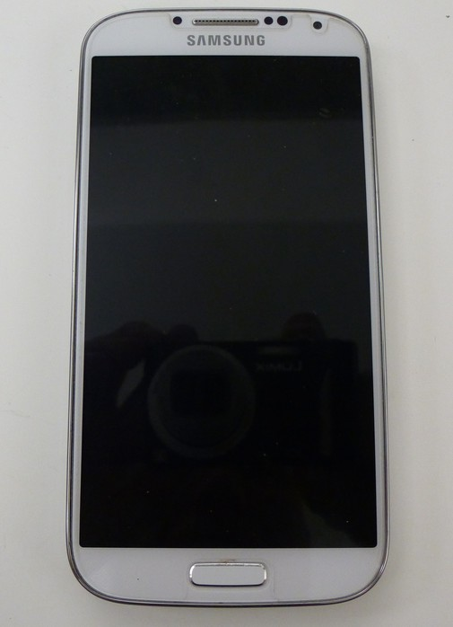
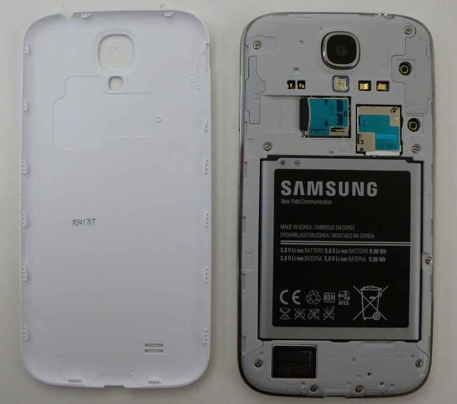
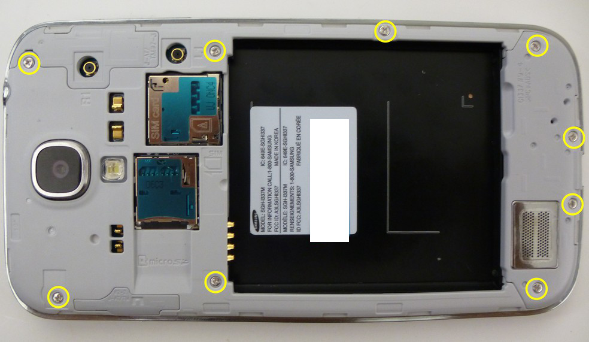
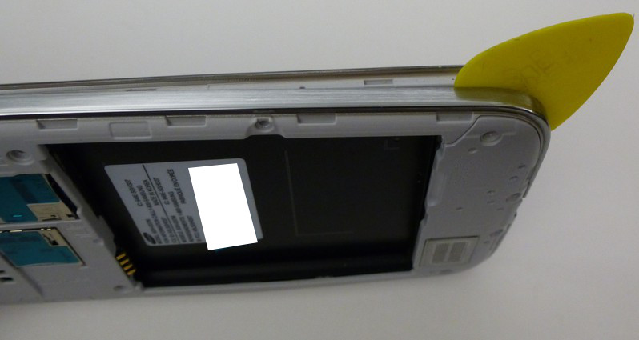
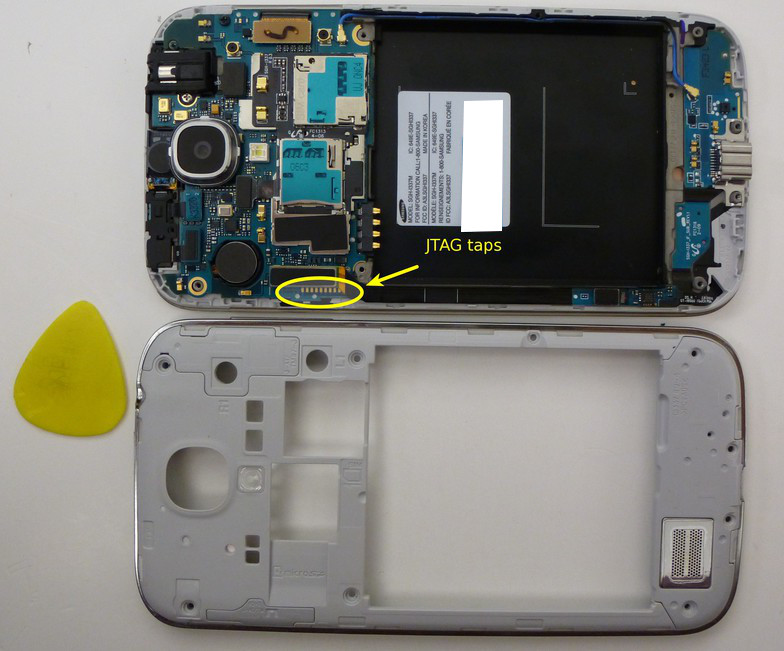
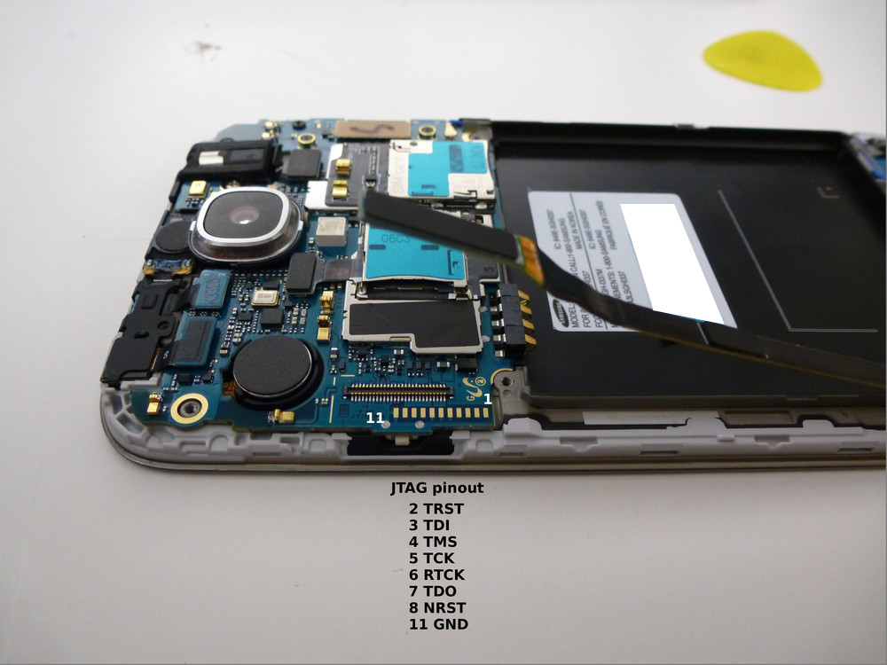
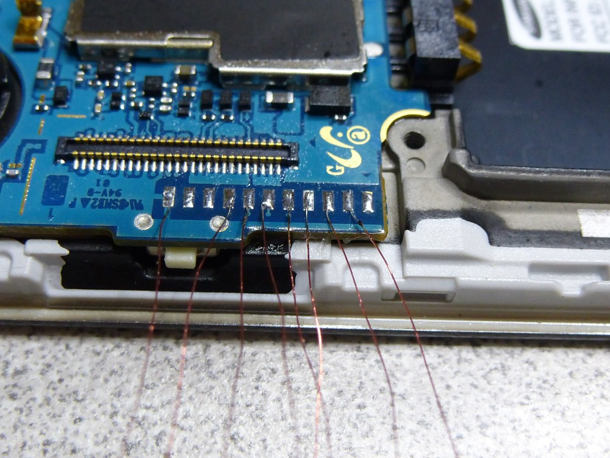
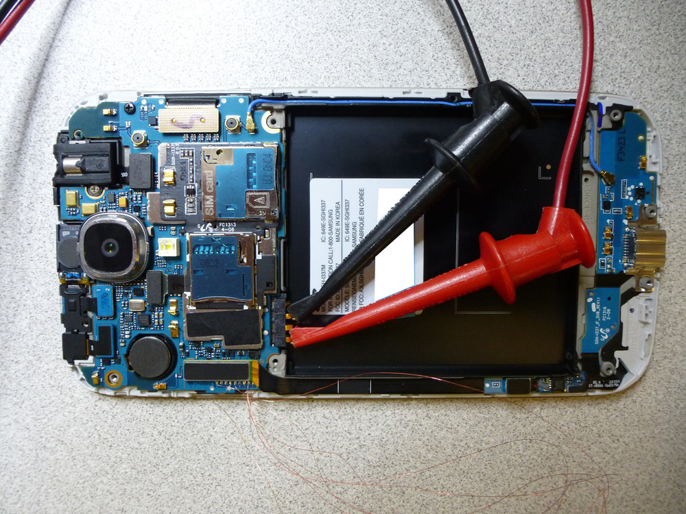
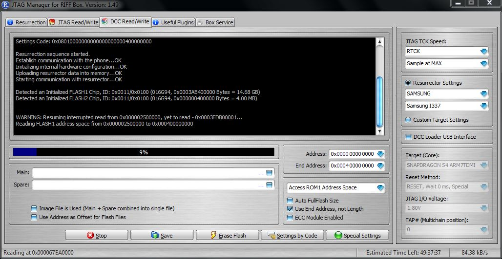

---
tags:
  - Mobile
---
## JTAG Samsung Galaxy S4

The Samsung Galaxy S4 is an Android based smartphone. At the time of
this writing (2013JUL24), I am unaware of any method other than JTAG to
acquire a physical image of the NAND on a Samsung Galaxy S4.

For the purpose of this document, a Samsung Galaxy S4 was disassembled,
read via JTAG, reassembled.

### Getting Started

What you need to dump the NAND:

1.  A [RIFF Box](https://www.riffbox.org/)
2.  Soldering skills and ultra-fine tip soldering iron (a JTAG jig may
    be available).
3.  A DC Power supply capable of supplying 3.8V/1.83A output. The power
    supply used for this was an U8002A DC Power Supply.

### NAND Dump Procedure

1.  Disassemble the phone down to the PCB.
2.  Connect the RIFF JTAG Box to the PC via USB.
3.  Connect the RIFF JTAG Box to the PCB via the JTAG pins.
4.  Connect the PCB to the DC power supply.
5.  Start the "RIFF BOX JTAG" software.
6.  Enable the power on the DC power supply.
7.  Power the phone via the power button.
8.  Dump the NAND via the RIFF Box software.

Instructions for disassembly can be found on Internet but it can be
summarized as follows:

- Remove the rear cover and battery.
- Remove the 9 x Phillips screws.
- Split the phone case using a case opening tool (guitar pick).

 
 <figcaption aria-hidden="true">1-S4-Phone.jpg</figcaption>

<figcaption aria-hidden="true">2-S4-BackCoverRemoved.jpg</figcaption>
 
 
 <figcaption aria-hidden="true">3-S4-RemoveScrews.jpg</figcaption>

<figcaption aria-hidden="true">4-S4-RemoveBackPlate.jpg</figcaption>

- Once the phone has been disassembled, you can see the JTAG connection
  port located right about the power button. This JTAG port is in a
  great spot which makes it handy for soldering.

 
 <figcaption aria-hidden="true">5-S4-BackPlateRemoved.jpg</figcaption>

- Solder the JTAG connector to the JTAG port as follows. I used 0.040
  gauge magnet wire to connected an adapter that was inserted into the
  20 pin ribbon cable supplied with the RIFF box.

 
 <figcaption aria-hidden="true">6-S4-JTAGpinouts.jpg</figcaption>

<figcaption aria-hidden="true">7-S4-Soldered.jpg</figcaption>

- Connect the PCB battery terminal connections to the DC power supply.
  The positive (+) connection is the outermost pin (1) and the negative
  (-) pin is the outermost pin (3). You can configure your power supply
  to match the battery specifications which in this case is 3.8V and
  1.80A but do not apply power at this time.

**NOTE:** Attempts the connect to and read this using power supplied via
the battery and USB port displayed inconsistent results. This is why we
opted to use the DC power supply.

 
 <figcaption aria-hidden="true">8-S4-NANDdump.jpg</figcaption>

- Now we can start the RIFF JTAG software and configure it, and connect
  the phone to the RIFF box. See the picture for more detail.

 
 <figcaption aria-hidden="true">9-S4-RiffBox.jpg</figcaption>

- Apply power to the DC power supply and turn the phone on using the
  button on the side of the PCB. After powering the phone on, select
  "READ" under the "DCC Read/Write" tab. If all goes well the "READ"
  button will become the "STOP" button and the phone will begin
  reading... if not the RIFF software provides troubleshooting steps
  that should be taken to assist in diagnosing some of the issues you
  may experience.

**NOTE:** In the event of read errors the RIFF software keeps track of
where the failure occurred and gives you option restart the read where
it left off.

- Once the acquisition is complete the resulting image can be saved and
  Forensic Analysis can take place using the tool of your choosing.

## References

* <https://forensics.spreitzenbarth.de/2012/02/>
