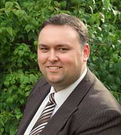

---
tags:
  -  People
---

Before becoming involved in the field of digital forensics Lee worked
for an international construction law company working directly under the
director responsible for forensic construction. Lee's passion for
computers caused him to enrol in the first Computing (Forensics) degree
at the University of Central Lancashire in Preston. Graduating three
years later Lee started his first job in digital forensics. It was here
that he gained a good grounding in the field. After two years he moved
to join his brother, Simon, at Zentek Forensics. Lee worked as the lab
manager and was directly responsible for all computer examinations
performed at Zentek. Lee then worked at Disklabs where he supervised all
computer investigations before moving his family to Dallas, Texas to
join Digital Discovery. Lee has now worked in the field for over eight
years and has conducted over 500 investigations and has experience in
cases involving child abuse, rape, attempted murder, fraud, intellectual
property theft, burglary, and so on. Lee is a SANS Community Instructor,
teach the FOR408 Windows Forensics class. Lee is also the creator of the
[Forensic 4cast](https://forensic4cast.com/) podcast and the [Forensic
4cast Awards](https://forensic4cast.com/forensic-4cast-awards/).

