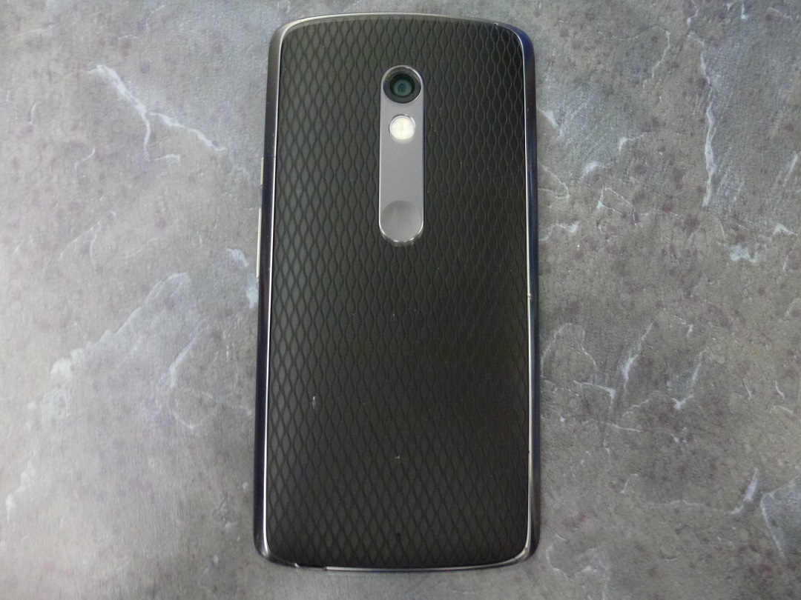
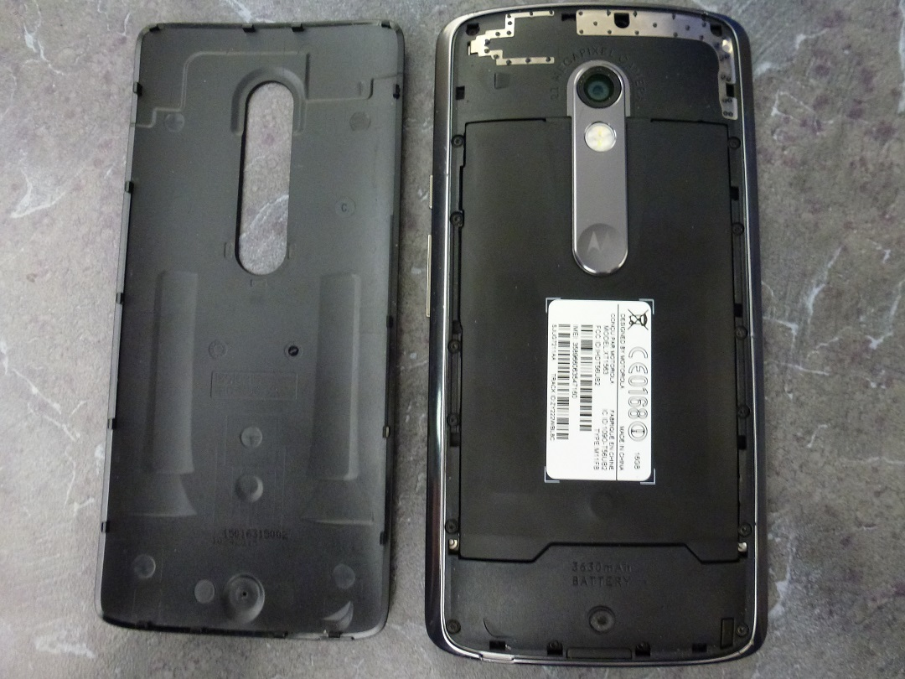
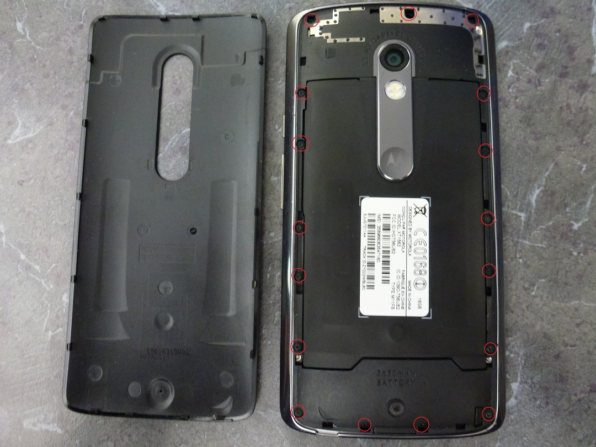
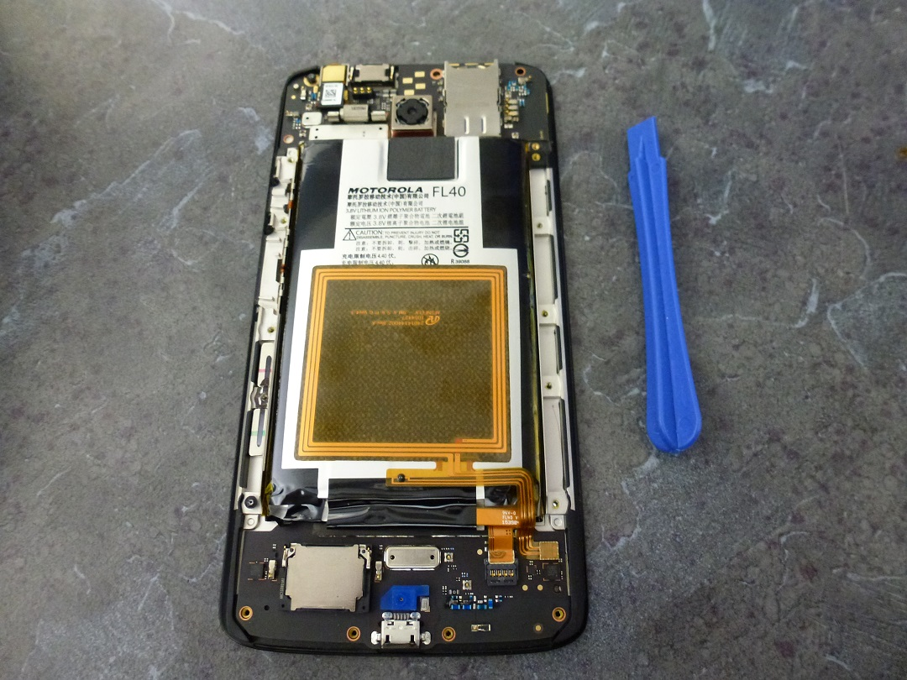
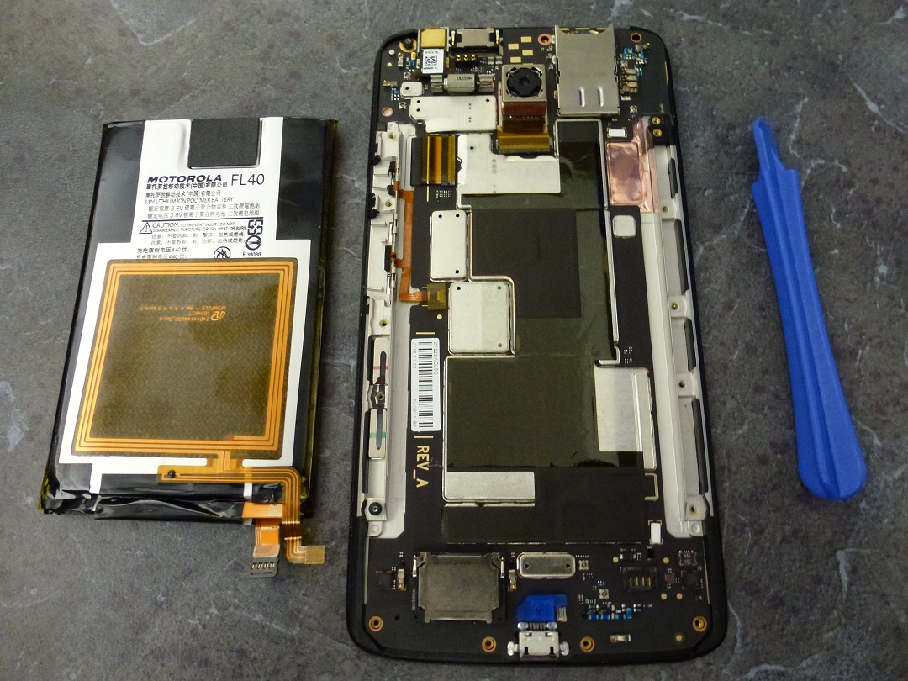
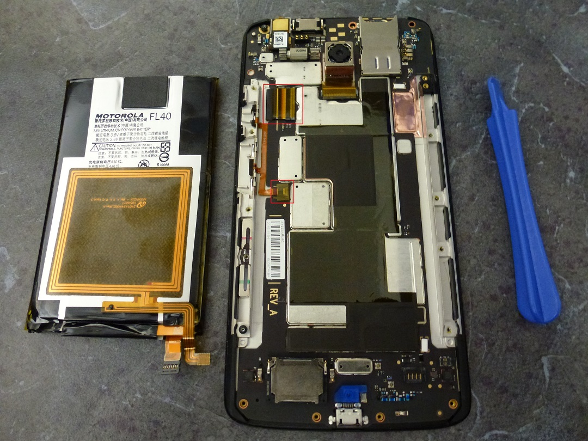
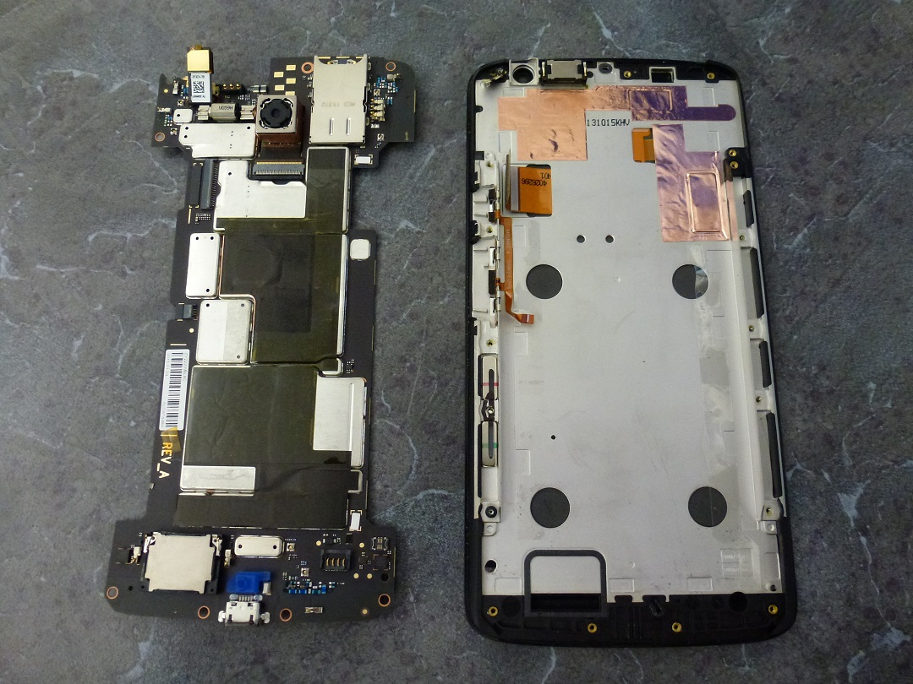
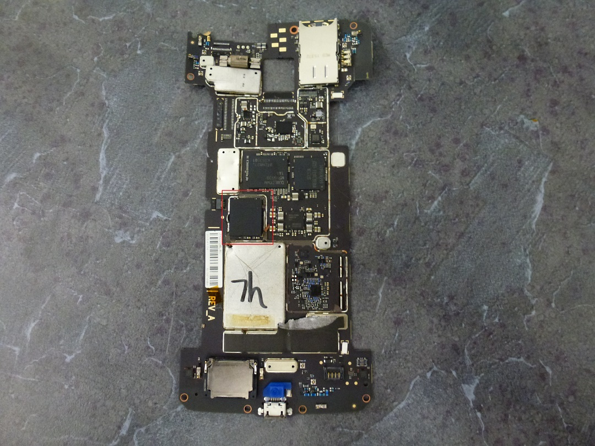
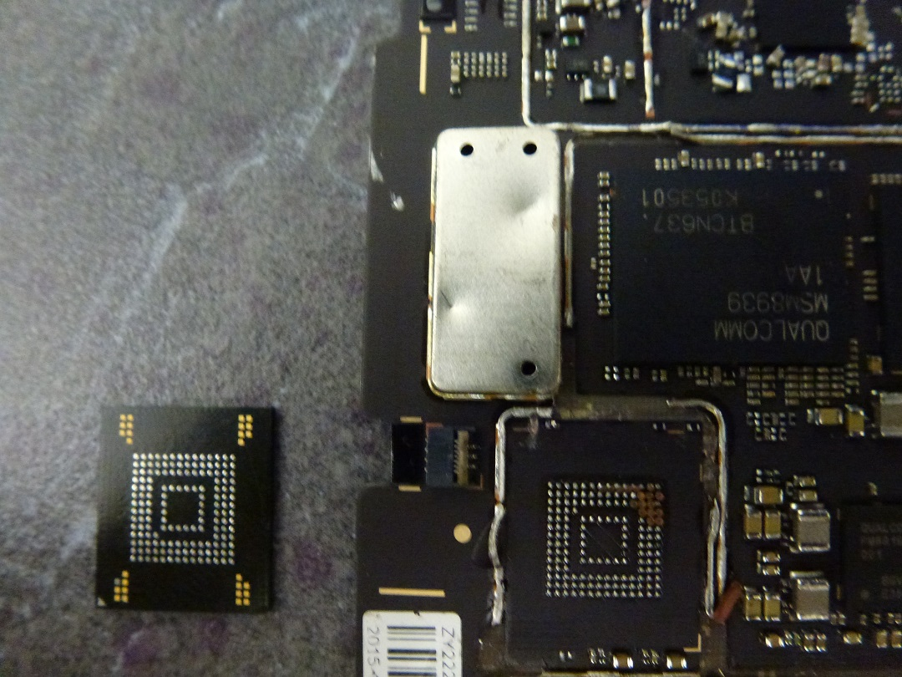
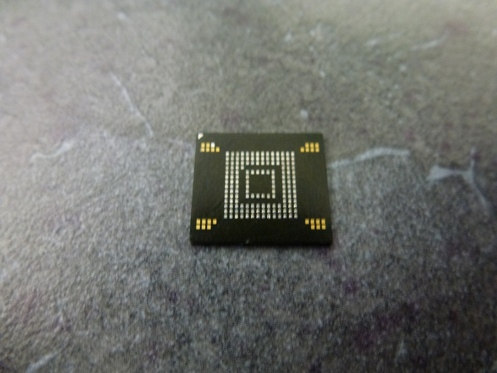

---
tags:
  - No Category
---
## Tear Down

 
 <figcaption aria-hidden="true">1xplay.JPG</figcaption>

1.  Remove the back panel, and SIM tray from the top of the phone.

 
 <figcaption aria-hidden="true">2xplay.JPG</figcaption>

2.  There are 17 Torx-4 screws that are glued in the back. Be careful
    not to strip them when removing them.

 
 <figcaption aria-hidden="true">2axplay.JPG</figcaption>
                                                           

<figcaption aria-hidden="true">3xplay.JPG</figcaption>

3.  Remove the two battery cables, and carefully peel the battery away
    from the glue on the motherboard.

 
 <figcaption aria-hidden="true">3axplay.JPG</figcaption>
         

<figcaption aria-hidden="true">4xplay.JPG</figcaption>
|                                                         |                                                                          |

4.  Remove the two ribbon cables from the left side of the motherboard
    and carefully peel it away from the glue on the underside. Be
    careful not to bend the board in the middle where all the chips
    reside.

 
 <figcaption aria-hidden="true">5axplay.JPG</figcaption>
                                                          
 
 <figcaption aria-hidden="true">5xplay.JPG</figcaption>

5.  Heat the middle of the board under a hot air gun until the heat
    shields pull off. The memory chip should also be ready to pull off
    at this point. Despite all the glue on the rest of the phone, there
    was no epoxy on our test phone’s NAND.

 
 <figcaption aria-hidden="true">6xplay.JPG</figcaption>

 
 <figcaption aria-hidden="true">7xplay.JPG</figcaption>

6.  Prepare the chip for reading with a little flux, and re-tin the pads
    if needed. In this case, our chip is a Toshiba THGBMFG7C2LBAIL/16GB
    which was read in an 11.5x13 Sireda adapter, and can also be read in
    an UP-828 programmer using the VBGA169E adapter.

 
 <figcaption aria-hidden="true">8xplay.JPG</figcaption>