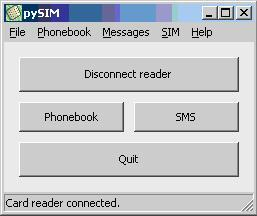

---
tags:
  - Articles that need to be expanded
  - Mobile Forensics 
---

pySIM (also called SimReader) is a relatively simple open source program
that accomplishes the following tasks:
- Downloads phonebook entries from a SIM Card
- Downloads SMS messages from a SIM Card
- Imports .txt files from other acquisitions

## Requirements

- Windows 98 or later
- Smart Card Base Components if using Win98, ME & NT 4.0
- GSM SIM Card Reader

## Benefits

- Cost of Ownership: Since pySIM is freeware it is not cost
prohibitive
- Ease of use: The simplicity of pySIM enables novice investigators to
acquire data
- Logging capabilities: Some competing SIM readers do not keep a
logfile
