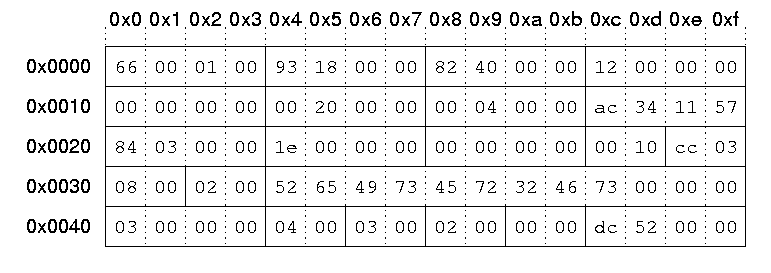

---
tags:
  - Articles that need to be expanded
  - File Systems
---
ReiserFs uses little-endian.

## Superblock

The superblock of a ReiserFS consist of:

| Name | Size | Description |
| --- | --- | --- |
| Block count | 4 | The number of blocks in the partition |
| Free blocks | 4 | The number of free blocks in the partition |
| Root block | 4 | The block number of the block containing the root node |
| Journal block | 4 | The block number of the block containing the first journal node |
| Journal device | 4 | Journal device number (not sure what for) |
| Orig. journal size | 4 | Original journal size. Needed when using partition on systems with different default journal sizes. |
| Journal trans. max | 4 | The maximum number of blocks in a transaction |
| Journal magic | 4 | A random magic number |
| Journal max batch | 4 | The maximum number of blocks in a transaction |
| Journal max commit age | 4 | Time in seconds of how old an asynchronous commit can be |
| Journal max trans. age | 4 | Time in seconds of how old a transaction can be |
| Blocksize | 2 | The size in bytes of a block |
| OID max size | 2 | The maximum size of the object id array |
| OID current size | 2 | The current size of the object id array |
| State | 2 | State of the partition: valid (1) or error (2) |
| Magic string | 12 | The reiserfs magic string, should be "ReIsEr2Fs" |
| Hash function code | 4 | The hash function that is being used to sort names in a directory |
| Tree Height | 2 | The current height of the disk tree |
| Bitmap number | 2 | The amount of bitmap blocks needed to address each block of the file system |
| Version | 2 | The reiserfs version number |
| Inode Generation | 4 | Number of the current inode generation |

### Example

```text
00000000 66 00 01 00 93 18 00 00 82 40 00 00 12 00 00 00  f........@......
00000010 00 00 00 00 00 20 00 00 00 04 00 00 ac 34 11 57  ..... ......¬4.W
00000020 84 03 00 00 1e 00 00 00 00 00 00 00 00 10 cc 03  ..............Ì.
00000030 08 00 02 00 52 65 49 73 45 72 32 46 73 00 00 00  ....ReIsEr2Fs...
00000040 03 00 00 00 04 00 03 00 02 00 00 00 dc 52 00 00  ............ÜR..
```



```text
Block count: 65638
Free blocks: 6291
Root block: 16514
Journal block: 18
Journal device: 0
Original journal size: 8192
Journal trans. max: 1024
Journal magic: 1460745388
Journal max. batch: 900
Journal max. commit age: 30
Journal max. trans. age: 0
Blocksize: 4096
OID max. size: 972
OID current size: 8
State: 2 (error)
Magic String: ReIsEr2Fs
Hash function code: 3
Tree height: 4
Bitmap number: 3
Version: 2
Inode generation: 21212
```

## External Links

* [Wikipedia: ReiserFS](https://en.wikipedia.org/wiki/Reiserfs)
