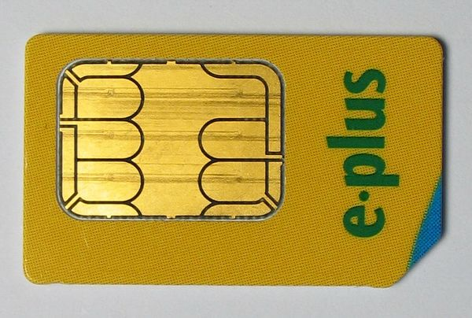

---
tags:
  - Mobile
  - SIM 
---

## SIM-Subscriber Identity Module

The UICC (Universal Integrated Circuit Card) is a smart card which
contains account information and memory that is used to enable GSM
cellular telephones. One of the applications running on the smart card
is the SIM, or Subscriber Identity Module. In common parlance the term
"UICC" is not used an the phrase "SIM" is used to describe the smart
card itself.

Because the SIM is just one of several applications running on the smart
card, a given card could, in theory, contain multiple SIMs. This would
allow multiple phone numbers or accounts to be accessed by a single
UICC. This is seldom seen, though there is at least one "12-in-1" SIM
card being advertised at present.

Early versions of the UICC used full-size smart cards (85mm x 54mm x
0.76mm). The card has since been shrunk to the standard size of 25mm x
15mm x 0.76mm.

Although UICC cards traditionally held just 16 to 64KB of memory, the recent
trend has been to produce SIM cards with larger storage capacities, ranging
from 512MB up to M-Systems' 1GB SIM Card slated for release in late 2006.

## ICCID

Each SIM is internationally identified by its ICC-ID (Integrated Circuit
Card ID). ICC-IDs are stored in the SIM card and can also be engraved or
printed on the SIM card’s body during a process called personalization.
The number is up to 18 digits long with an addition of a single “check
digit” that is used for error detection. This single digit allows us to
detect an input error of digits, mistyped digits or a permutation of two
successive digits. This digit was calculated using the Luhn algorithm.

A typical SIM (19 digits) example 89 91 10 1200 00 320451 0, provide
several details as follows:

* The first two digits (89 in the example) refers to the Major Industry
  Identifier.
* The next two digits (91 in the example) refers to the country code
  (91-India).
* The next two digits (10 in the example) refers to the issuer
  identifier number.
* The next four digits (1200 in the example) refers to the month and
  year of manufacturing.
* The next two digits (00 in the example) refers to the switch
  configuration code.
* The next six digits (320451 in the example) refers to the SIM number.
* The last digit which is separated from the rest is called the checksum
  digit.

These digits can be further grouped for additional information:

* The major Industry Identifier, Country Code, and Issuer Identifier
  Number make up the Issuer Identification Number (IIN) which is a
  maximum of 7 digits.
* The next several digits (variable length) represent the Individual
  Account Identification Number
* The final digit is a checksum digit

## Location Area Identity

Operation networks for cell phone devices are divided into area
locations called Location Areas. Each location is identified with its
own unique identification number creating the LAI (Location Area
Identity). A phone will store this number on its SIM card so it knows
what location it’s in and to be able to receive service. If a phone were
to change to a new Location Area, it stores the new LAI in the SIM card,
adding to a list of all the previous LAIs it has been in. This way if a
phone is powered down, when it boots back up, it can search its list of
LAIs it has stored until it finds the one its in and can start to
receive service again. This is much quicker than scanning the whole list
of frequencies that a telephone can have access on. This is a real plus
for forensic investigators because when a SIM card is reviewed, they can
get a general idea of where the SIM card has been geographically. In
turn this tells them where the phone has been and can then relate back
to where the individual who owns the phone has been.

## SIM Security

Information inside the UICC can be protected with a PIN and a PUK.

A PIN locks the SIM card until correct code is entered. Each phone
network sets the PIN of SIM to a standard default number (this can be
changed via handset). If PIN protection is enabled, the PIN will need to
be entered each time phone is switched on. If the PIN is entered
incorrectly 3 times in a row, the SIM card will be blocked requiring a
PUK from the network/service provider.

A PUK is needed if the PIN is entered incorrectly 3 times and the SIM is
blocked (phone is unable to make and receive calls/texts). The PUK can
be received from the network provider, or possibly the GSM cell phone
manual. **Caution:** if PUK is entered 10 times incorrectly, the SIM
card is permanently disabled and must be exchanged.

## SIM Forensics

The data that a SIM card can provide the forensics examiner can be
invaluable to an investigation. Acquiring a SIM card allows a large
amount of information that the suspect has dealt with over the phone to
be investigated.

In general, some of this data can help an investigator determine:

* Phone numbers of calls made/received
* Contacts
* [SMS](sms.md)
* SMS text (the message itself)

There are many software solutions that can help the examiner to acquire
the information from the SIM card. Several products include:

* [3GForensics SIMIS](http://www.3gforensics.co.uk/)
* Inside Out's [SIMCon](http://simcon.no/)
* SIM Content Controller
* Paraben Forensics' [SIM Card Seizure](http://www.paraben-forensics.com/catalog/product_info.php?products_id=289)

The SIM file system is hierarchical in nature consisting of 3 parts:

* Master File (MF) - root of the file system that contains

DF’s and EF’s

* Dedicated File (DF)
* Elementary Files (EF)

### Data Acquisition

These software titles can extract such technical data from the SIM card
as:

* **International Mobile Subscriber Identity (IMSI)**: A unique
  identifying number that identifies the phone/subscription to the
  [GSM](gsm.md) network
* **Mobile Country Code (MCC)**: A three-digit code that represents the
  SIM card's country of origin
* **Mobile Network Code (MNC)**: A two-digit code that represents the
  SIM card's home network
* **Mobile Subscriber Identification Number (MSIN)**: A unique ten-digit
  identifying number that identifies the specific subscriber to the GSM
  network
* **Mobile Subscriber International ISDN Number (MSISDN)**: A number
  that identifies the phone number used by the headset
* **Abbreviated Dialing Numbers (ADN)**: Telephone numbers stored in
  sims memory
* **Last Dialed Numbers (LDN)**
* **Short Message Service (SMS)**: Text Messages
* **Public Land Mobile Network (PLMN) selector**
* **Forbidden PLMNs**
* **Location Information (LOCI)**
* **General Packet Radio Service (GPRS) location**
* **Integrated Circuit Card Identifier (ICCID)**
* **Service Provider Name (SPN)**
* **Phase Identification**
* **SIM Service Table (SST)**
* **Language Preference (LP)**
* **Card Holder Verification (CHV1) and (CHV2)**
* **Broadcast Control Channels (BCCH)**
* **Ciphering Key (Kc)**
* **Ciphering Key Sequence Number**
* **Emergency Call Code**
* **Fixed Dialing Numbers (FDN)**
* **Forbidden PLMNs**
* **Local Area Identitity (LAI)**
* **Own Dialing Number**
* **Temporary Mobile Subscriber Identity (TMSI)**
* **Routing Area Identifier (RIA) netowrk code**
* **Service Dialing Numbers (SDNs)**
* **Service Provider Name**
* **Depersonalizatoin Keys**

This information can be used to contact the service provider to obtain
even more information than is stored on the SIM card.

## USIM-Universal Subscriber Identity Module

A Universal Subscriber Identity Module is an application for UMTS mobile
telephony running on a UICC smart card which is inserted in a 3G mobile
phone. There is a common misconception to call the UICC card itself a
USIM, but the USIM is merely a logical entity on the physical card.

It stores user subscriber information, authentication information and
provides storage space for text messages and phone book contacts. The
phone book on a UICC has been greatly enhanced.

For authentication purposes, the USIM stores a long-term preshared
secret key K, which is shared with the Authentication Center (AuC) in
the network. The USIM also verifies a sequence number that must be
within a range using a window mechanism to avoid replay attacks, and is
in charge of generating the session keys CK and IK to be used in the
confidentiality and integrity algorithms of the KASUMI block cipher in
Universal Mobile Telecommunications System (UMTS).

In Mobile Financial Services, USIM seems to be a mandetory Security
Element for user authentication, authorization and stored credentials.
With the integration of NFC Handset and USIM, users will be able to make
proximity payments where the NFS handset enables contactless payment and
USIM enables independent security element. This is the evolution of the
SIM for 3G devices. It can allow for multiple phone numbers to be
assigned to the USIM, thus giving more than one phone number to a
device.

## Service Provider Data

Some additional information the service provider might store:

* A customer database
* Call Detail Records
* Home Location Register

## Service Providers that use SIM Cards in the United States

* T-Mobile
* Cingular/AT&T

## Sim Card Text Encoding

Originally the middle-European [GSM](gsm.md) network used only a
7-bit code derived from the basic [ASCII](ascii.md) code.
However as GSM spread worldwide it was concluded that more characters,
such as the major characters of all living languages, should be able to
be represented on GSM phones. Thus, there was a movement towards a
16-bit code known as UCS-2 which is now the standard
in GSM text encoding. This change in encoding can make it more difficult
to accurately obtain data form [SIM cards](sim_cards.md) of the
older generation which use the 7-bit encoding. This encoding is used to
compress the hexadecimal size of certain elements of the SIMs data,
particularly in [SMS](sms.md) and Abbreviated Dialing Numbers.

## Authentication Key (Ki)

The authentication key or Ki is a 128 bit key used in the authentication and
cipher key generation process. In a nutshell, the key is used to authenticate
the SIM on the GSM network. Each SIM contains this key which is assigned to it
by the operator during the personalization process. The SIM card is specially
designed so the Ki can't be compromised using a smart-card interface. However,
flaws in the GSM cryptography have been discovered that do allow the extraction
of the Ki from the SIM card, and essentially SIM card duplication.

## See also

* [SIM Card Forensics](sim_card_forensics.md)
* [SIM Explorer](sim_explorer.md)

## External Links

* [SIMCon](http://www.simcon.no/)
* [Sector Forensics](http://www.sectorforensics.co.uk/sim-examination.shtml)
* [IJDE Spring 2003 Volume 2, Issue 1](http://www.utica.edu/academic/institutes/ecii/ijde/articles.cfm?action=issue&id=5)
  [Forensics and the GSM Mobile Telephone System](http://www.utica.edu/academic/institutes/ecii/publications/articles/A0658858-BFF6-C537-7CF86A78D6DE746D.pdf)
* [Wikipedia: SIM card](https://en.wikipedia.org/wiki/SIM_card)
* [Forensics and SIM cards: an Overview](http://www.utica.edu/academic/institutes/ecii/publications/articles/EFE3EDD5-0AD1-6086-28804D3C49D798A0.pdf)
