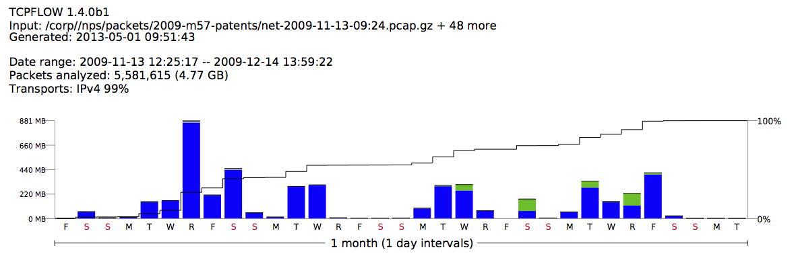

---
tags:
  - Network Forensics
---
**tcpflow** is a program that captures data transmitted as part of TCP
connections (flows), and stores the data in a way that is convenient for
protocol analysis and debugging. Each TCP flow is stored in its own
file. Thus, the typical TCP flow will be stored in two files, one for
each direction. tcpflow can also process stored ‘tcpdump’ packet flows.

tcpflow is similar to ‘tcpdump’, in that both process packets from the
wire or from a stored file. It's also similar to WireShark, in that both
allow analysis of network traffic. But unlike either tcpdump or
WireShark, tcpflow reconstructs thousands (or millions) of TCP
connections at a time and saves the results in ordinary files, making it
easy to analyze the data with conventional tools.

tcpflow understands sequence numbers and will correctly reconstruct data
streams regardless of retransmissions or out-of-order delivery.

## Overview

tcpflow stores all captured data in files that have names of the form

128.129.130.131.02345-010.011.012.013.45103

where the contents of the above file would be data transmitted from host
*128.129.131.131* port *2345*, to host *10.11.12.13* port *45103*.

Specify the **-Fk** , **-Fm'' or**-Fg''' options if you are likely to
have more than 1000 connections; this will cause tcpflow to create
subdirectories automatically. You can also use other options to create
directors for each host or port.

Specify the **-e netviz** option to enable the network visualization
layer, and make a pretty picture like this:

## Limitations

- tcpflow does not understand IP fragments;
- tcpflow does not understand 802.11 headers.

## History

Jeremy Elson developed the first version of tcpflow in 1999 but stopped
maintaining it in 2003. In 2006 Simson Garfinkel took over maintenance
of the program and added:

- support for VLANs
- support for IPv6
- [DFXML](dfxml.md) output of the connections in a
  **report.xml** file.
- Improved performance through the use of the C++ STL classes.
- Support for continuous operation (tcpflow now purges out old flows).
- Variable Filename specifications.
- A plug-in architecture.

tcpflow is based on the LBL Packet Capture Library (available from LBL)
and therefore supports the same rich filtering expressions that programs
like ‘tcpdump’ support. It should compile under most popular versions of
UNIX; see the INSTALL file for details.

## External Links

* [Project page](https://www.circlemud.org/jelson/software/tcpflow/)

### Distributions

* [Slackware package](http://kaneda.bohater.net/slackware/packages/)
  by [Kanedaaa](http://kaneda.bohater.net)
* [Debian package](https://packages.debian.org/testing/tcpflow)
  by Robert McQueen
* [Fedora package](https://admin.fedoraproject.org/pkgdb/acls/name/tcpflow)
  by [Terje Røsten](https://koji.fedoraproject.org/koji/userinfo?userID=278)
* [FreeBSD port](ftp://ftp5.freebsd.org/pub/FreeBSD/branches/-current/ports/net/tcpflow)
  by Jose M. Alcaide
* [OpenBSD Package](http://www.openbsd.org/ports.html) (it’s in there
  somewhere)
* [Solaris 8 SPARC Binary](ftp://ftp.sunfreeware.com/pub/freeware/sparc/8/tcpflow-0.12-sol8-sparc-local.gz)
  for v0.12 from [SunFreeware.com](http://www.sunfreeware.com/introduction.html)
